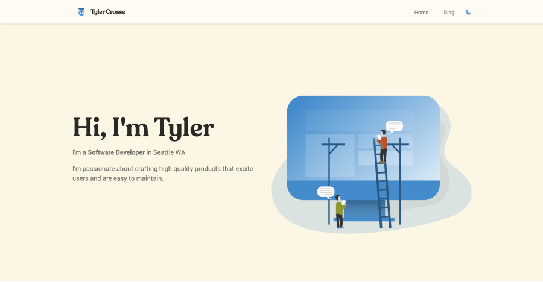
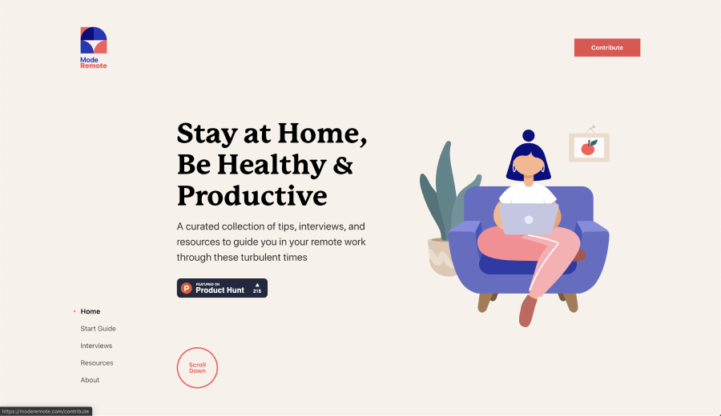
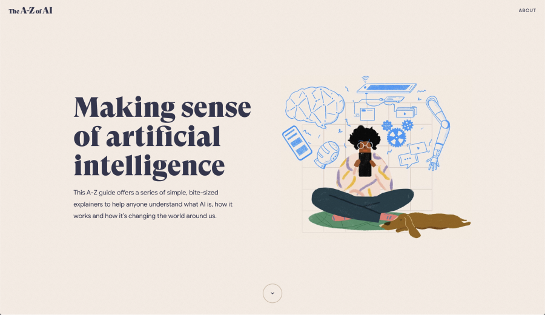
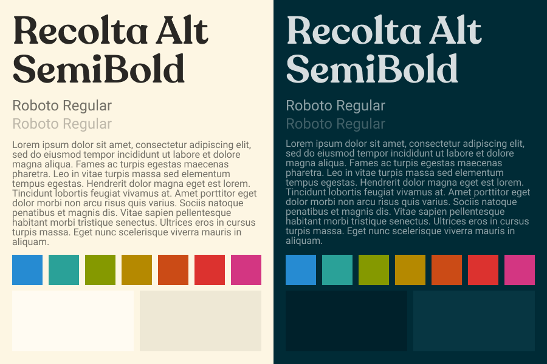

This is the first post of my new blog. Welcome!

#### Goals

I started this project has started with some simple goals, to:

- Practice Typescript, and Gatsby.
- Try out some new tools like Tailwindcss.
- Recreate my portfolio site.
- Start blogging (practice writing).

### Site Architecture

Here's a quick rundown of the sites architecture.

- I did most of the styling is done with the help of [Tailwind CSS](https://tailwindcss.com/).
- The site is powered by Gatsby with the React components written in [Typescript](https://www.typescriptlang.org/).
- Implementing these choices was fast tracked by building off of the [gatsby-typescript-tailwind starter](https://www.gatsbyjs.org/starters/impulse/gatsby-typescript-tailwind/).
- Blog posts are written in markdown which is parsed by remark. Syntax highlighting for code snippets is handled by prismjs. Gatsy makes this easy with plugins, [gatsby-transformer-remark](https://www.gatsbyjs.org/packages/gatsby-transformer-remark/) and [gatsby-remark-prismjs](https://www.gatsbyjs.org/packages/gatsby-remark-prismjs/) do most of the heavy lifting.

### 1. Design - Colors, Fonts, & Figma

When considering how to visually present my page, I knew I wanted to create something simple and clean. I started looking for inspiration by browsing a ton of landing pages on [lapa.ninja](https://www.lapa.ninja/) for inspiration. The process of narrowing down my search was difficult – with so many wonderful pages out there, I got a little decision fatigue.

Eventually, I was able to find two sites to pull queues from; [Mode Remote](https://moderemote.com/) and [The A-Z of AI](https://atozofai.withgoogle.com/intl/en-US/). They both have dramatic
display fonts, warm palettes, and minimal layouts.





For the site's colors, I used [solarized light/dark](https://github.com/altercation/solarized). Solarized is the coding theme I've used for the last 4 years, and so it felt like a natural choice for me. The light version is similar to the palettes of my inspiration sites.

For the site's typography, I wanted to find something that expressed my personal taste and style while maintaining clarity and simplicity. I decided to try out RecoletaAlt as the display font and Roboto as the body font. Recoleta feels like a warmer, younger version of some classic 1970s fonts like ITC Souvenir. Picking out a body font was tricky for because there are so many out there that all look great! However, I was able to narrow it down to Lato, Open Sans, Poppi, and Montserrat as my finalists. To aid in me picking a final choice I perfromed side-by-side comparisons using [typetester](http://classic.typetester.org/). Ultimately, Roboto won because its crispness and legibility aligned most closely with my theme of “clean and simple”.


A style guide of my chosen fonts and colors.

Before writing any code I used a pencil and paper and then [Figma](https://www.figma.com/) to prototype designs. This was my first time using Figma and I'm impressed. I've got a good amount of experience with Adobe XD, Illustrator, Photoshop, and Sketch, and wanted to experiment with a new tool. I found Figma to be intuitive, fast, have all of the features I needed, and - best of all - it was free. I'm definitely inspired to do a project with [WebAssembly](https://www.figma.com/blog/webassembly-cut-figmas-load-time-by-3x/) now too!

### 2. Styling - Tailwind CSS

The frontend community has been buzzing about Tailwind CSS since it's release - this project seemed like the perfect opportunity to see what all the fuss was about. So far, it's been a treat! At its core Tailwind CSS a collection of CSS classes that individually apply small amounts of CSS. Things like the class `flex` which adds `display: flex` to whatever element it's applied to.

Tailwind utility classes are generated dynamically based on a config. This allows you to use themes, set custom sizes for margin, padding, breakpoints, fonts, and a good bit more. Tailwind includes utilities that make creating responsive designs incredibly easy. It also allows you build components or reuse sets of utility classes with the `@apply` directive.

To demonstrate, here's the markup for the footer of this site:

```html
<footer
  class="flex items-center justify-center p-10 bg-white border-t border-theme-p2"
>
  <div class="mr-10 text-theme-s7">© Tyler Crosse - All rights reserved.</div>
  <a
    class="flex items-center p-4 mx-4 text-theme-s7 hover:text-theme-s8"
    href="https://linkedin.com/in/tylercrosse/"
  >
    <!-- svg omitted -->
    LinkedIn
  </a>
  <a
    class="flex items-center p-4 mx-4 text-theme-s7 hover:text-theme-s8"
    href="https://github.com/tylercrosse/"
  >
    <!-- svg omitted -->
    Github
  </a>
  <a
    class="flex items-center p-4 ml-4 text-theme-s7 hover:text-theme-s8"
    href="mailto:tylerscottcrosse@gmail.com?Subject=You're Hired!"
  >
    <!-- svg omitted -->
    Email
  </a>
</footer>
```

I was able to build it in less than 5 minute without writing any css and that includes searching the Tailwind docs. You can't get much easier than that!

Another interesting consequence of using Tailwind is that it reduces the amount of css that needs to be bundled with apps. A common consequence of of standard css practices like BEM, OOCSS, or even css in js options like Emotion or styled components is the size of css bundles. Style attributes end up getting duplicated over and over again. It's not uncommon for bundle size to grow nearly linearly with the amount of elements. In short, the more elements, the more css.

With Tailwind CSS the size of the CSS bundle grows closer to logarithmically, with a max near the total number of css rules available. Classes are reused but the css isn't duplicated.

### 3. Frontend Stack - Gatsby & Typescript

This portion assumes you're familiar with what [React](https://reactjs.org/), [Gatsby](https://www.gatsbyjs.org/), and [Typescript](https://www.typescriptlang.org/) are and some of the pros/cons to using them.

As I mentioned earlier in this post, this site is built using React written in Typescript. Some of you may thinking "Why? Isn't that overkill for a site that could be totally static?" There is a valid argument to this point. Forcing clients to load React before the page becomes fully interactive certainly has a negative impact on important site metrics like Time To Interactive (TTI) and Total Blocking Time (TBT). The previous version of my personal site was incredibly fast - it had minimal markup, small assets, and a tiny amount of js sprinkled on for interactivity. Using a similar approach for this site would have almost certainly be more performant.

The answer to question "Why?" in a complicated app is a lot simpler. In most instances the performance hit is worth the increased maintainability and ease of implementation that is provided by a library like React or a Framework like Gatsby. For this particular project I've placed more value on learning new skills than on performance metrics in absolute terms.

Gatsby squeezes out at least enough performance for the tradeoff to be less of a concern. Gatsby also makes it pretty easy import lots of different data sources and add plugins. Implementing these choices was fast tracked by building off of the [gatsby-typescript-tailwind starter](https://www.gatsbyjs.org/starters/impulse/gatsby-typescript-tailwind/).

I wanted to work on and deploy a Typescript project for a while. All of the Typescript projects I've started to date have been too ambitious. With this project I wanted to learn with a scaffolded approach, building off what I already know. I have a lot of experience with React and Gatsby which gives me good foundation start with.

While working on this site, I used the following resources: the official [Typescript Handbook](https://www.typescriptlang.org/v2/docs/handbook/) and docs, the [React TypeScript](https://react-typescript-cheatsheet.netlify.app/), and the [Typescript Deep Dive](https://basarat.gitbook.io/typescript/). There were parts of each resource that complemented one another. The official handbook provides a good overview and is great reference. The React TypeScript CheatSheet contextualizes Typescript with common problems faced while working with React. The Typescript Deep Dive has a bit of both and I liked have an additional perspective.

### Future state

There are a lot of things I’d like to add onto and improve for site. Here are a few:

- Implementing general design improvements and refinement, especially around the experience on mobile.
- Adding an index of Tags. It could be cool to build a graph visualization of how tags are interconnected across posts.
- Adding site search.
- Creating some sort of project showcase.

Keep an eye out for future posts on these!
