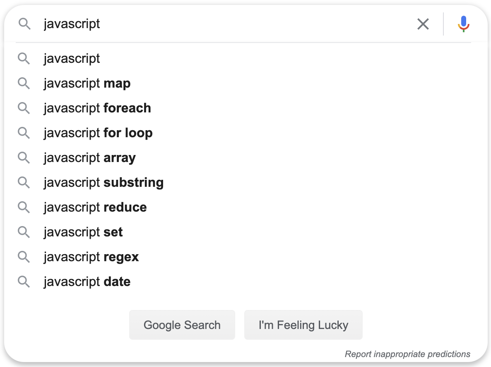
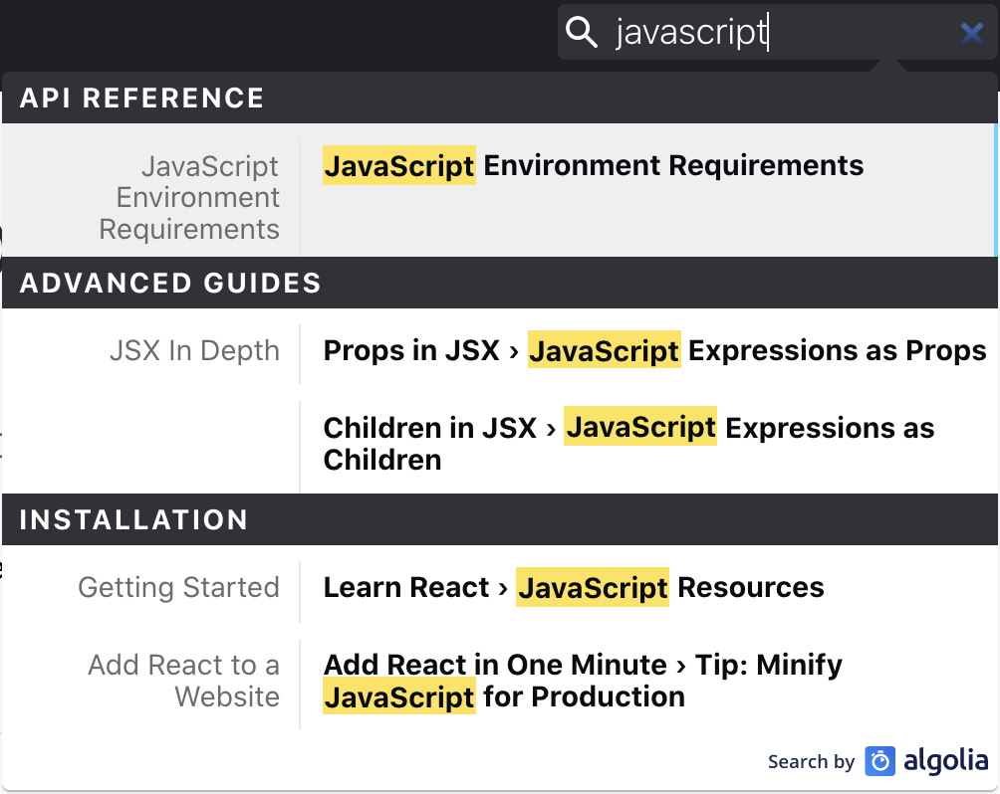
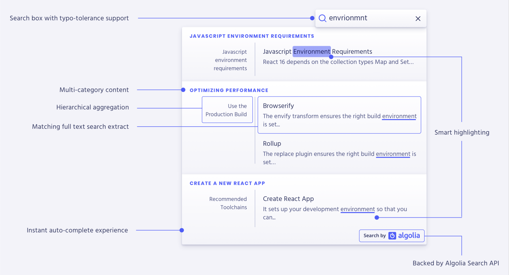

Adding search to a site or application can greatly impact how easy it is to navigate. This has a positive impact on how many pages users may navigate and the time they spend on pages because they can find content that is relevant to what they are looking for. This post discusses some of the design decisions I made when determining how to add search to this site. It also touches on some research I did when trying to approach this problem. To see how I implemented it [jump to part 2](/blog/search-part2-implementation).

## Background

I started pretty broad with definitions and worked progressively narrower towards examples that best fit my use case.

#### What is Search?

Search is one of many kinds of information retrieval systems. Any information retrieval aims to provide the searcher with information relevant to what they were looking for, usually to accomplish a broader goal or information-seeking behavior. Information retrieval is a subject that leans heavily on the formalism of many other subjects, including data structures and algorithms, linear algebra, probability theory, human interaction design, and natural language processing.

## Search UX

Autocomplete is ubiquitous when it comes to search these days. Users expect possible searches and content to be suggested to them as they type. Autocomplete is frequently seen in two primary forms, one where it's used to suggest searches and take users to a search page with more detailed results. The other main approach is where the suggestions are of actual content and choosing a suggestion takes users directly to that content.

### Autocomplete as an entry to a search results page

This works well when there are a lot of results and a lot of different kinds of results. The canonical example is Google. The results page has rich content that is tailored to the query.

Another example of this type of search experience is Amazon. The results page on Amazon is faceted and allows users to filter and narrow their results.

### Autocomplete as the entire search experience

An alternative user experience is to have autocomplete suggest results instead of queries. The big difference here is when a user picks a suggestion, it takes them directly to the result instead of using the suggestion to perform a search, as we saw with Google and Amazon.

The [Spotlight Search](https://developer.apple.com/design/human-interface-guidelines/macos/system-capabilities/search-and-spotlight/) on OSX is a great example. It provides suggested results across many different categories of content. I've chosen to gloss over the other fantastic things Spotlight also does, like being able to do math and provide interactive previews of content, all of which feel out of scope for my search feature.

[Algolia Docsearch](https://docsearch.algolia.com/) is another example of this flavor of search UX that most developers are likely familiar with.

Here's a breakdown of some of the key features of Algolia Docsearch from their product page.

#### How do these implementations work?

The big players in the search space like Google and Amazon use incredibly sophisticated techniques to make query suggestions for autocomplete and return relevant results. They do things like perform stemming and spelling corrections based on pronunciations which are then fed into a cascade of additional ML models to determine the intent of the searching behavior, the relationship to similar queries, and possible results. Once a query is selected, it depends on well-built indexes and smart techniques for using those indexes across enormous distributed datasets.

## Design Decisions for my Search

My site has the huge benefit of not having much content, especially compared to all the web pages on the internet. This means I don't need to do much to improve the relevance of the results. String matching with a little typo tolerance and ranking is plenty. I like the general UI of Mac Spotlight and Algolia with results grouped into categories and how matching strings are highlighted. For my site I wanted to start with searching across blog posts, expand it to tags, and then potentially to additional content types like project breakdown if I add them to my site in the future.

Typically searches performed on the web involve making a request to the server, which then returns results. This site is static, meaning it doesn't make additional requests to the server for data beyond loading pages the first time. Static search then, like static sites, does not involve making a round trip to a server to request data after the page loads. This makes searches a lot quicker and the implementation simpler to add. The tradeoff here is that static searches are more limited in the amount of data they can index and handle. They are also slightly more limited in the complexity of a search implementation since all of the logic for performing searches is performed on the client. For my simple static blog and personal site I'll never have the volume of data that would make this an issue. Start with the skateboard and [KISS](https://en.wikipedia.org/wiki/KISS_principle).

## Possible solutions

Here's the list of features I had narrowed down to:

1. Fairly simple and easy to implement.
2. Works with a static site, or at least doesn't require me to manage a server.
3. Performs typo tolerant string matching.
4. Could potentially be used with an index across multiple content categories or multiple indexes.

I cast a fairly broad net here as well. I was able to quickly cross off the options I would need to manage, like any of the [Apache Lucene](https://lucene.apache.org/) derived searches - [Solr](https://lucene.apache.org/solr/) and [Elasticsearch](https://www.elastic.co/elasticsearch/). I also quickly nixed the search as a service provides including [Algolia](https://www.algolia.com/), [swiftype](https://swiftype.com/), and [searhcspring](https://searchspring.com/). These are all great options but work well for larger datasets than the one I'm dealing with.

> Forming queries is a harder task for users than analyzing results.

I then took a look at search libraries that could be used on static sites. [Lunr](https://lunrjs.com/) and [js-search](https://github.com/bvaughn/js-search), Brian Vaughn alternative to Lunr, are good options here. They use the nearly ubiquitous tf-idf as a weighting factor for their indexes. They have handy utilities for improving the quality of the indexes like performing tokenization, stemming, removing stop words. These techniques are table stakes with the managed and SaaS options mentioned above but are nice to see on a library meant to run on the client (static). The biggest shortcoming I found when playing with these was the lack of typo tolerance. They could return the most relevant result but only with a correctly formed query. As someone with careless fingers, typo tolerance is a must-have.

Two other interesting options I looked at were [Stork](https://github.com/jameslittle230/stork) and [tinysearch](https://github.com/mre/tinysearch). Both of which are written in Rust and compiled to WebAssembly which helps reduce the size of the library code and improve the speed of accessing an index. Again these options lack typo tolerance. If you don't need the ability to perform fuzzy searches or are willing to correct queries these could be other great options.

As far as fuzzy searching (approximate string matching) goes the popular JS libraries include [fuse.js](https://github.com/krisk/Fuse), [flexsearch](https://github.com/nextapps-de/flexsearch), [fuzzaldrin](https://github.com/atom/fuzzaldrin), and [fuzzaldrin-plus](https://github.com/jeancroy/fuzz-aldrin-plus). These all work in slightly different ways; fuse uses a modified [bitap algoritm](https://en.wikipedia.org/wiki/Bitap_algorithm) (not bitmap) to score results. Flexsearch has an optional contextual index that is supposed to aid in the relevance and speed of multi-term queries. Fuzzaldrin and Fuzzaldrin-plus are both libraries designed for searching paths, methods, and other code-specific search tasks and inputs.

After an initial broad search for libraries based on their features, Fuse and Flexsearch seemed to be the two best choices. Beyond the feature set, I also looked at how well maintained and popular they are. Here's a link to an [npm trends comparison](https://www.npmtrends.com/fuse.js-vs-flexsearch-vs-lunr-vs-js-search-vs-fuzzaldrin-vs-fuzzaldrin-plus) of these and the js libraries I already mentioned. Fuse has far and away the most popular with over **2 million weekly** downloads and 11.3k GitHub stars at the time of writing this. Lunr is a distant second with a still respectable 500k weekly downloads and 7.1k GitHub stars.

From all of these data points, it felt like fuse was the choice that made the most sense for my desired requirements. It's easy to implement, can be set up with minimal configuration, works well on the client-side, quickly returns results, supports fuzzy queries (approximate string matching), is well maintained, thoroughly documented, and popular. The most significant downsides to it seem to be that it will occasionally return false positives or results that don't make sense. For example, when searching for '**react**,' it registers a partial hit on '**creat**e'. This slight negative felt like an acceptable tradeoff.

Check out how the nuts and bolts of how I added a Fuse.js powered search to my site in [part two](/blog/search-part2-implementation) on this series of posts on search.

## References & Additional Resources

- [13 Design Patterns for Autocomplete Suggestions (27% Get it Wrong)](https://baymard.com/blog/autocomplete-design)
- [Mobile UX Design: User-Friendly Search](https://uxplanet.org/mobile-ux-design-user-friendly-search-51e5f78f5a1e)
- [Best Practices for Search Results](https://uxplanet.org/best-practices-for-search-results-1bbed9d7a311)
- [Design a Perfect Search Box](https://uxplanet.org/design-a-perfect-search-box-b6baaf9599c)
- [5 important things you need to consider when designing for search](https://blog.prototypr.io/5-easy-and-effective-tips-to-get-more-out-of-your-search-f53d55d063de)
- [Designing Search](https://blog.prototypr.io/designing-search-c96cc5d05ddf)
- [Search interface: 20 things to consider](https://uxplanet.org/search-interface-20-things-to-consider-4b1466e98881)
- [Best UX Practices for Search Interface](https://qubstudio.com/blog/best-ux-practices-for-search-interface/)
- [UX Psychology: Google Search](https://jonyablonski.com/articles/2020/ux-psychology-google-search/)
- [Search UI Patterns: Elements](https://medium.com/@ddsky/search-ui-patterns-elements-80ea9d241f97)
