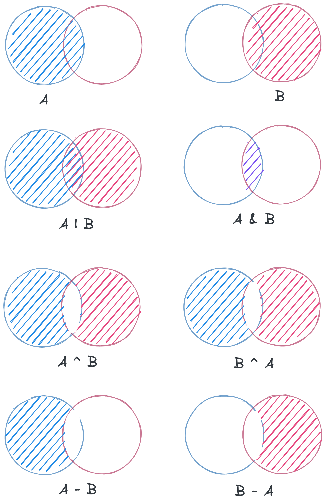

As journeyman python developer, I was surprised to find that Python allows bitwise operators to be used on sets. I was even more surprised to find that they work on dicts as well. So, here's a quick post on how to use them.

## Bitwise Operations on sets

I'm assuming most folks that find this article have seen bitwise operators before and included a primer for those that haven't at the bottom of this article. In Python, The bitwise operators OR `|`, AND `&`, as well as XOR `^` work on sets in the same way they work on integers. I also included difference `-`, subset, and superset here because they are common set operation with a similar shorthand, although it is not a bitwise operation. The same is true regardless of the data type of the elements in the sets. Additionally, sets support updates using the bitwise assignment operations `|=`, `&=`, as well as `^=`. For example, the following code:

```py
a = {1, 2, 3}
b = {2, 3, 4}

# Union 
print(a | b) # {1, 2, 3, 4} Equivalent to a.union(b)

# Intersection 
print(a & b) # {2, 3} Equivalent to a.intersection(b)

# Symetric Difference
print(a ^ b) # {1, 4} Equivalent to a.symmetric_difference(b)
print(b ^ a) # {1, 4}

# Difference
print(a - b) # {1} Equivalent to a.difference(b)
print(b - a) # {4}

# Subset
print(a <= b) # False Equivalent to a.issubset(b)
print(a < b) # False Equivalent to a.issubset(b) and a != b

# Superset
print(a >= b) # False Equivalent to a.issuperset(b)
print(a > b) # False 

# NOTE: |, &, ^ are commutative, while -, >, < is not
``` 

<div style="max-width: 560px">
  
</div>

One pontential gotcha is that the methods accept iterables, so if you pass a list or tuple, you will get a set back. There isn't an equivalent approach for itererables using the bitwise assignment operators. For more details see the [Python API docs for Set](https://docs.python.org/3/library/stdtypes.html#set-types-set-frozenset). 

## Bitwise Operations on dicts

Bitwise operations on dicts are a little more interesting. [Python 3.9](https://docs.python.org/3/whatsnew/3.9.html) added support for the `|` and `|=` operations on dicts. These operations nearly equivalent to `dict.update()`, they update the first dict with the key-value pairs from the second dict. The `|` operation is not commutative, so the order of the dicts matters. For example, the following code:

```py
a = {1: 'a', 2: 'b'}
b = {2: 'c', 3: 'd'}

print(a | b) # {1: 'a', 2: 'c', 3: 'd'}
print(b | a) # {2: 'b', 3: 'd', 1: 'a'}
```

For the curious here is the [PEP proposal to add union operators to dict](https://peps.python.org/pep-0584/) and the [Github MR for the change](https://github.com/python/cpython/pull/12088). I got a kick out of reading the conversation with the submitter and Guido von Rossum, as well as how little code was needed for the change.

#### Appendix A - Bitwise Operators

For folks that haven't seen them before. Python has the following bitwise operators:

<details>

```py
| # OR
1 | 0 = 1
1 | 1 = 1
0 | 1 = 1
0 | 0 = 0

& # AND
1 & 0 = 0
1 & 1 = 1
0 & 1 = 0
0 & 0 = 0

^ # XOR
1 ^ 0 = 1
1 ^ 1 = 0
0 ^ 1 = 1
0 ^ 0 = 0

~ # NOT
~1 = 0
~0 = 1

<< # Left Shift
1 << 1 = 10
1 << 2 = 100

>> # Right Shift
1 >> 1 = 0
10 >> 2 = 1
100 >> 2 = 10
```

</details>

#### Appendix B - Differences in Bitwise Opcodes

Out of curiosity I ran the following code to see how the bitwise operators are implemented in CPython (version 3.10.8). No shock that differnt syntax resutls in different opcodes. I may try to update this post with more details later, I'm still curious about how these opcodes translate into the difference in behavior in CPython. Something for another day.

<details>

```py
# Given sets
a = {1, 2, 3}
b = {2, 3, 4}

print(dis.dis("a | b"))
#  1           0 LOAD_NAME                0 (a)
#              2 LOAD_NAME                1 (b)
#              4 BINARY_OR
#              6 RETURN_VALUE

print(dis.dis("a.union(b)"))
#  1           0 LOAD_NAME                0 (a)
#              2 LOAD_NAME                1 (b)
#              4 LOAD_METHOD              2 (union)
#              6 CALL_METHOD              1
#              8 RETURN_VALUE

print(dis.dis("a & b"))
#  1           0 LOAD_NAME                0 (a)
#              2 LOAD_NAME                1 (b)
#              4 BINARY_AND
#              6 RETURN_VALUE

print(dis.dis("a.intersection(b)"))
#  1           0 LOAD_NAME                0 (a)
#              2 LOAD_NAME                1 (b)
#              4 LOAD_METHOD              2 (intersection)
#              6 CALL_METHOD              1
#              8 RETURN_VALUE

print(dis.dis("a ^ b"))
#  1           0 LOAD_NAME                0 (a)
#              2 LOAD_NAME                1 (b)
#              4 BINARY_XOR
#              6 RETURN_VALUE

print(dis.dis("a.symmetric_difference(b)"))
#  1           0 LOAD_NAME                0 (a)
#              2 LOAD_NAME                1 (b)
#              4 LOAD_METHOD              2 (symmetric_difference)
#              6 CALL_METHOD              1
#              8 RETURN_VALUE

print(dis.dis("a - b"))
#  1           0 LOAD_NAME                0 (a)
#              2 LOAD_NAME                1 (b)
#              4 BINARY_SUBTRACT
#              6 RETURN_VALUE

print(dis.dis("a.difference(b)"))
#  1           0 LOAD_NAME                0 (a)
#              2 LOAD_NAME                1 (b)
#              4 LOAD_METHOD              2 (difference)
#              6 CALL_METHOD              1
#              8 RETURN_VALUE
```

</details>

### Additional Resources

- Detailed post on all things bitwise in Python: [Bitwise Operators in Python](https://realpython.com/python-bitwise-operators/)
- A post comparing different ways of merge Python dictionaries [New Union Operators to Merge Dictionaries in Python 3.9](https://betterprogramming.pub/new-union-operators-to-merge-dictionaries-in-python-3-9-8c7dbbd1080c)
- CPython Source code for the set object in v3.10.8: [Objects/setobject.c](https://github.com/python/cpython/blob/v3.10.8/Objects/setobject.c)