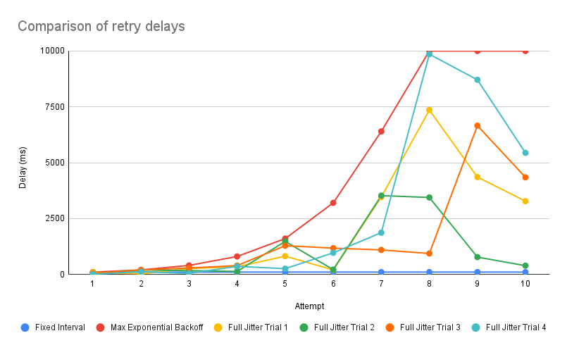

## If at first you don't succeed

You know the drill. A service makes a request that fails. You've determined that it failed for a reason that might be resolved by trying again - maybe the service you're calling is down, or the network is flaky, or the service you're calling is just slow. Often denoted by 429 Too Many Requests, 500 Internal Server Error, 503 Service Unavailable, or 504 Gateway Timeout.

Trying again immediately might work or it could make things worse by bogging down the service you are requesting with a lot of unecessary requests. So you wait a bit and try again. The simpilest way to do this is to wait a fixed amount of time before trying again.

<div style="max-width: 480px">
  
</div>

Here's an example implementation in TypeScript:

```ts
function requestWithRetry(maxRetries = 8) {
  let attempt = 0;
  return async function request(url, options) {
    try {
      const response = await fetch(url, options);
      if (response.ok) {
        return response;
      }
      throw new Error(response.statusText);
    } catch (error) {
      if (attempt < maxRetries) {
        attempt += 1;
        const delay = 100; // ⏰ Where the delay is 'calculated'
        console.warn(`Request failed. Retry attempt ${attempt} after ${delay}ms`)
        await new Promise((resolve) => setTimeout(resolve, delay));
        return request(url, options);
      }
      throw error; // 🚨 Throw the error if we've reached the max number of retries
    }
  };
}

// Usage
const response = requestWithRetry()('https://example.com/')

// Request failed. Retry attempt 1 after 100ms
// Request failed. Retry attempt 2 after 100ms
// Request failed. Retry attempt 3 after 100ms
// ...
```

## Slow down there buddy

Unfortunately, adding a fixed delay only helps if it allows the service enough time to catch up. This is where [exponential backoff](https://en.wikipedia.org/wiki/Exponential_backoff) comes in. A simple approach is to increase the length of the delay for each subsequent attempt. The constant used for the delay may need to be adjusted depending on the service you're calling.

<div style="max-width: 500px">
  
</div>

```ts
/**
 * Simple exponential backoff
 * 100, 200, 400, 800, 1600, 3200, 6400, 12800, 25600, 51200...
 */ 
function simpleBackoff(attempt) {
  const BASE = 100;
  return Math.pow(2, attempt) * BASE;
}
```

We can then update our example `requestWithRetry` function like so:

```ts
...
      if (attempt < maxRetries) {
        attempt += 1;
        const delay = simpleBackoff(attempt) // 🚧 The delay now changes
        console.warn(`Request failed. Retry attempt ${attempt} after ${delay}ms`)
        await new Promise((resolve) => setTimeout(resolve, delay));
        return request(url, options);
      }
...

// Request failed. Retry attempt 1 after 100ms
// Request failed. Retry attempt 1 after 200ms
// Request failed. Retry attempt 1 after 400ms
// ...
```

## To the Max

We can improve this slightly by capping the delay. This is useful if the service you are requesting is slow and you don't want to wait too long before giving up. We can do this by taking the minimum of the calculated delay and a maximum delay. This value along with the delay will depend on the service you are requesting. 

```ts
/**
 * Simple exponential backoff with a max delay
 * 100, 200, 400, 800, 1600, 3200, 6400, 10000, 10000, 10000...
 */
function maxBackoff(attempt) {
  const BASE = 100;
  const MAX_DELAY = 10000;
  const exponential = Math.pow(2, attempt) * BASE;
  return Math.min(exponential, MAX_DELAY);
}
```


## Collisions & Jitter

The problem with the previous approaches is that if multiple requests fail at the same time, they will all retry at the same time. These [collisions](https://en.wikipedia.org/wiki/Exponential_backoff#Collision) can exacterbate the problem by causing a lot of unnecessary load on the service you are requesting. To avoid this, we can add some randomness to the delay and make the delay non-deterministic. This is called [jitter](https://en.wikipedia.org/wiki/Jitter). The simplest way to do this is to add a random number to the delay. The downside is that the delay will be longer than the calculated delay. [AWS suggests](https://aws.amazon.com/blogs/architecture/exponential-backoff-and-jitter/) adding a lot of variance to the delay is the best way to avoid collisions. The intervals no longer follow a nice curve but they are more likely to succeed.

```ts
/**
 * Max exponential backoff with jitter
 * ex1. 95, 26, 260, 336, 1227, 200, 3463, 7356, 4355, 3277...
 * ex2. 37, 197, 167, 130, 1476, 211, 3525, 967, 772, 389...
 */
function maxBackoffJitter(attempt) {
  const BASE = 100;
  const MAX_DELAY = 10000;
  const exponential = Math.pow(2, attempt) * BASE;
  const delay = Math.min(exponential, MAX_DELAY);
  return Math.floor(Math.random() * delay);
}
```



Exponential backoff and jitter are simple techniques that can help you to automatically retry requests and not blow stuff up. 

### Additional Resources

- [Exponential backoff](https://en.wikipedia.org/wiki/Exponential_backoff) on Wikipedia
- [Exponential Backoff And Jitter](https://aws.amazon.com/blogs/architecture/exponential-backoff-and-jitter/) on the AWS Architecture Blog
- [Retry Pattern](https://docs.microsoft.com/en-us/azure/architecture/patterns/retry) on Azure's list of Architecture Design Patterns
- [Retry strategy](https://cloud.google.com/storage/docs/exponential-backoff) on Google Cloud's documentation
- [Implementing Exponential Backoff](https://cloud.google.com/iot/docs/how-tos/exponential-backoff) on Google Cloud's guides

