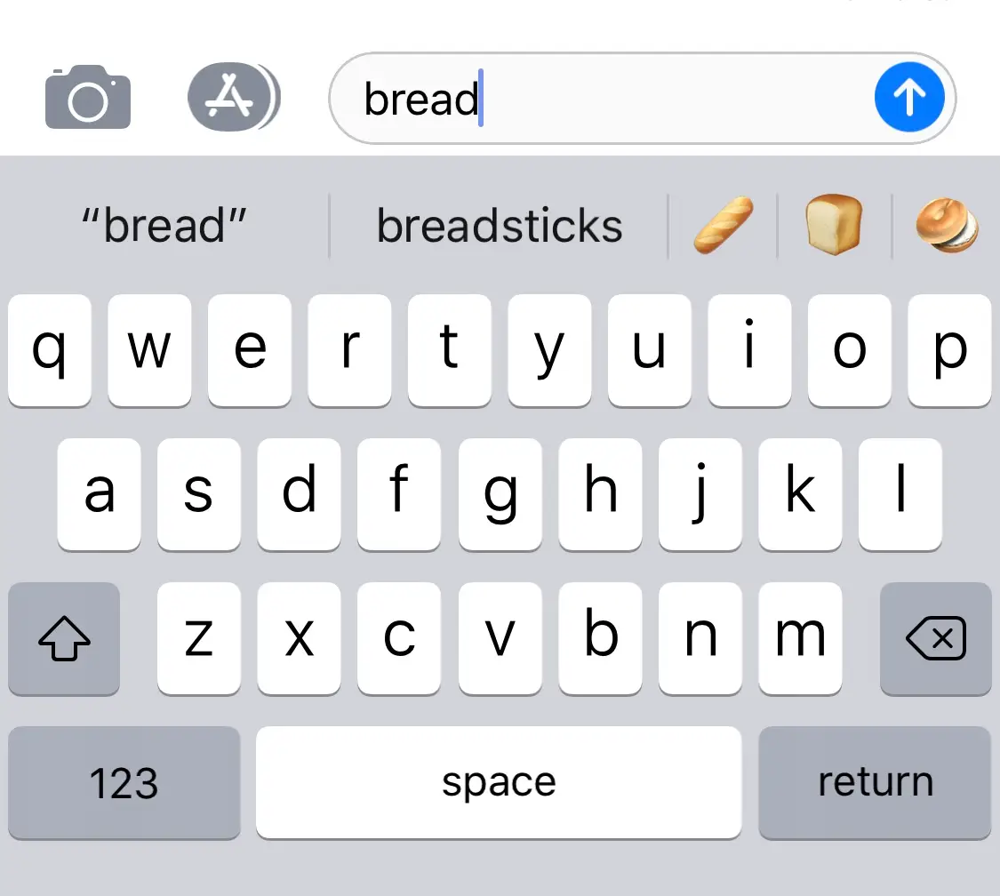
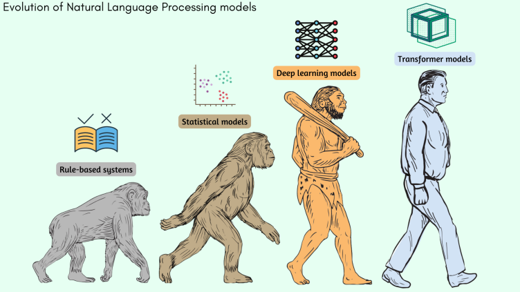
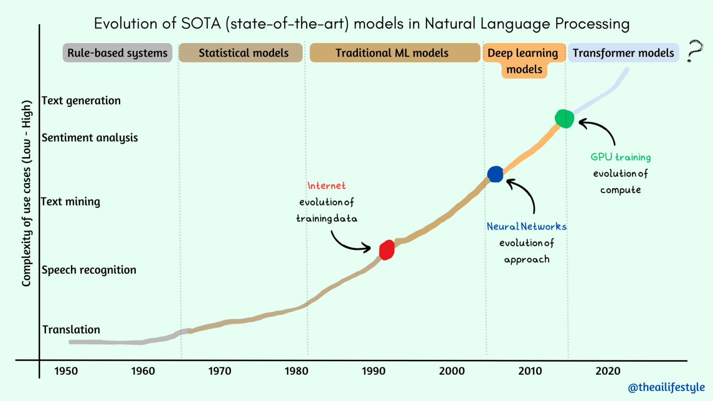

ChatGPT has had runaway success since it was released on November 30th, 2022. It's a great example of how language models can be used to solve real-world problems. It seems like every tech company is rushng to build their own models or add features that use language models in their products. Yet outside of AI practioners the level of understanding of how they work is slow coming. In this article, we'll take a look at what language models are, how they work, and how they can be used to solve real-world problems.

## What are language models?

Setting the stage, a model is a simplified representation of a system. It's a way to make sense of the world around us. Models are used in many fields to make predictions about the future. For example, a weather model is used to predict the weather. A financial model is used to predict the stock market.

A language model does just what its name implies, it model language. Like any other model it can be used to make predictions or simplify patterns in the thing being modeled, in this case language.

Language modeling predates ChatGPT by a long time and before large-language models took over there were different methods to build simpiler langauge models. These simpiler models are still useful for a variety of tasks and are worth understanding. They are also the foundation for the more complex models like ChatGPT.

You're likely already familiar with a few uses of language models like autocomplete suggestions in search engines and next word suggestions on your phone. These are examples of language models that are used to make predictions about text.

<div style="max-width: 360px;">
  
</div>

<div style="max-width: 500px;">
  
</div>

## N-gram models

One popular, simpiler type of approach to building a model is called "n-gram" modeling.

Think of a sentence as a chain of words. An n-gram model looks at how often certain words or groups of words appear together in a big collection of sentences. For example, if you have the sentence "The quick brown fox jumps over the lazy dog," a 1-gram model would look at each word individually, like "The," "quick," "brown," "fox," "jumps," "over," "the," and "lazy." A 2-gram model would consider pairs of words, like "The quick," "quick brown," "brown fox," and "fox jumps."


```
The quick brown fox jumps over the lazy dog
```

The idea is that the more often certain word combinations appear together, the more likely they are to show up again. The model keeps track of these probabilities. So if the model has seen the sentence "The quick brown fox jumps over the lazy dog" many times, it knows that the words "quick" and "brown" are often followed by "fox."

When you give a language model a starting word or phrase, it uses these probabilities to predict the most likely next word or phrase. So if you start with "The quick," the model would guess that the next word might be "brown" or "fox" because those combinations have been seen frequently before.


## More complex models

N-gram models are a good starting point for understanding language models. But they have some limitations. For example, they can't handle words that are far apart in a sentence. They also can't handle words that have multiple meanings. For example, the word "bank" can mean a financial institution or the side of a river. An n-gram model can't tell which meaning is correct in a given sentence.

> The core problem is that language is complex.

Several generations of language models have been developed to better model all of the complexities and nuances of language. How models evolved over time is a good way to understand how language models work.

- **Simple statistical models like n-grams** have been around since the 1950s.
- **Neural network models.** Neural networks were first applied to language modeling in the 1980s. They are a more sophisticated statistical approach that draws inspiration from neurons and were able to model more complex patterns in language than n-gram models. But they were still limited by the amount of data available at the time.
- **Transformer based models like BERT** were introduced in 2017. They are a special type of neural network and were able to model even more complex patterns in language than traditional neural networks. Part of their success is that they are easier to train in parallel and able to take advantage of the large amounts of data that were becoming available. This was the ushering in of the modern era of large language models.
- **Really big transformers like GPT3 .**
  When Generative Pre-trained Transformer 3 (GPT3) was released in 2020 it exhibited markedly better performance than previous models. It's a transformer model that was trained on a huge amount of data. It's able to model even more complex patterns in language than previous models. It's also able to generate text that is indistinguishable from human-written text.
- **ChatGPT,** released on November 30th, 2022. It uses several advancments built on top of GPT3 that make it more useful to interact with. Some of the notable advanes are **reinforcement learning from human feedback** and **instruction tunning.**


## Evolution of Language Models

Language modeling in general can that is used to make predictions about text. Common examples include predicting the next word in a sequence of words or even the next sentence given a sentence of text. They can also be used to classify poritions of text to help identify areas of similarity. 






## Limitations of language models


The problem of ambiguity in natural language

The limitations of rule-based models


## What's Next?


Recap of the importance and applications of language models

Future developments in the field of language models

## Additional Resources

- https://lena-voita.github.io/nlp_course/language_modeling.html

- https://huggingface.co/blog/rlhf

- https://karpathy.ai/zero-to-hero.html

- https://www.nlpdemystified.org/

---

Scrap


## Applications of Language Models

With the nearly constant news on ChatGPT and large-langauge models it's easy to overlook many of the most common uses for language models. Yet applications of language models have been around for years and have gotten more sophisticated over time. Here are some of the most common applications of language models:

- Text completion - The autocomplete suggestions in search engines uses a type of language model. As does the next word suggestions that you see when typing on your phone.

<div style="max-width: 360px;">
  
</div>

<div style="max-width: 500px;">
  
</div>

- Text classification - The spam detection and auto grouping features built into email applications like Gmail and Outlook use language models to classify emails. As do the categories that show up in review sites like Amazon and Yelp.

- Text summarization - Language models are also used to condensing text, generating headlines

- Text generation - chatbots, machine translation