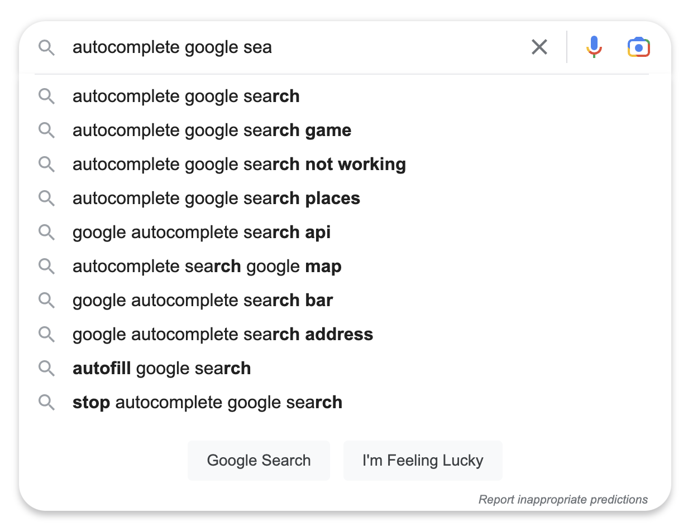
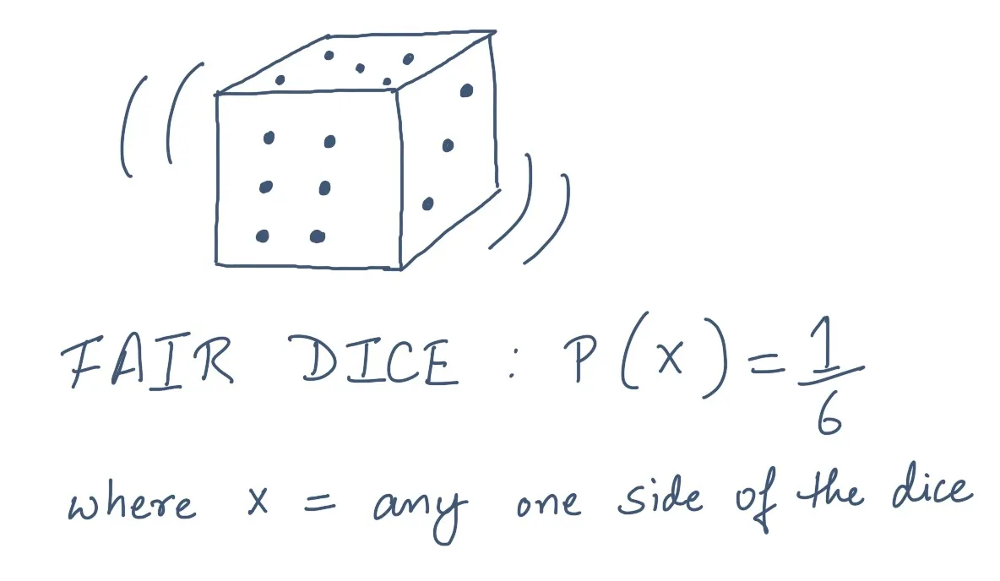
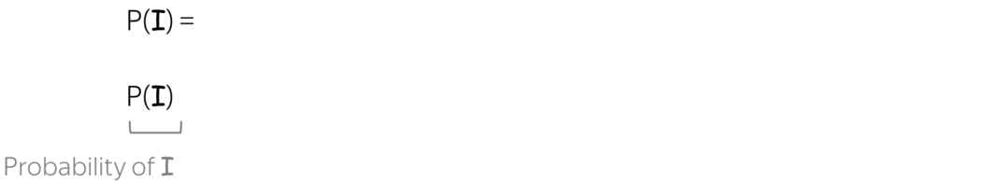
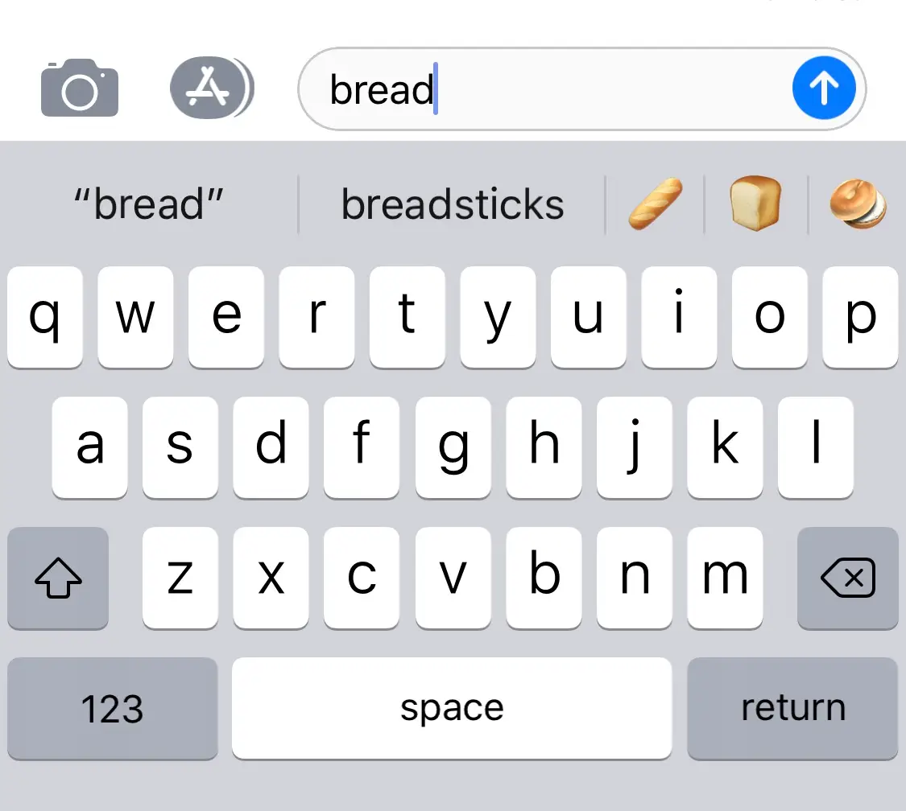
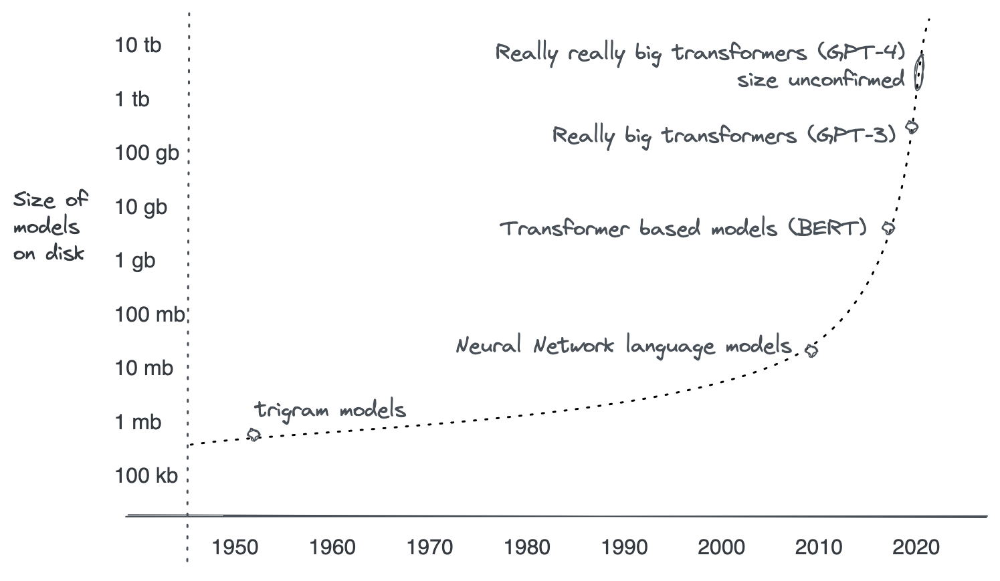

ChatGPT has had runaway success since it was released on November 30th, 2022. It's a great example of how language models can be used to solve real-world problems. It seems like every tech company is rushing to build their own models or add features that use language models in their products. Yet outside of AI practitioners the level of understanding of how they work is slow coming. In this article, we'll take a look at what language models are, how they work, and how they can be used to solve real-world problems.

## What are language models?

Setting the stage, a model is a simplified representation of a system. It's a way to make sense of the world around us. Models are used in many fields to make predictions about the future. For example, a weather model is used to predict the weather. A financial model is used to predict the stock market.

A language model does just what its name implies, it models language. Like any other model, it can be used to make predictions or simplify patterns in the thing being modeled, in this case, language.

Language modeling predates ChatGPT by a long time and before large-language models took over there were different methods to build simpler language models. These simpler models are still useful for a variety of tasks and are worth understanding. They are also the foundation for more complex models like ChatGPT.

You're likely already familiar with a few uses of language models like autocomplete suggestions in search engines and next-word suggestions on your phone. These are examples of language models that are used to make predictions about text.

<div style="max-width: 500px;">
  
</div>

## N-gram models


One popular, simple type of approach to building a model is called "n-gram" modeling.

Think of a sentence as a chain of words. An n-gram model looks at how often certain words or groups of words appear together in a big collection of sentences. For example, if you have the sentence "The quick brown fox jumps over the lazy dog," a 1-gram model would look at each word individually, like "The," "quick," "brown," "fox," "jumps," "over," "the," and "lazy." A 2-gram model would consider pairs of words, like "The quick," "quick brown," "brown fox," and "fox jumps."


```
The quick brown fox jumps over the lazy dog
```

The idea is that the more often certain word combinations appear together, the more likely they are to show up again. The model keeps track of these probabilities. So if the model has seen the sentence "The quick brown fox jumps over the lazy dog" many times, it knows that the words "quick" and "brown" are often followed by "fox." 

What is often referred to as training or building a model involves running a large collection of sentences through this process to build up these probabilities. As each sentence is fed in the probabilities shift slightly as words get repeated in different orders and proportions - it 'learns' and refines the statistical relationships of the training data. The more sentences that are used to train the model, the more accurate it will be.

<div style="max-width: 500px;">
  
</div>

We're all familiar with the basics of probability, you throw a die and you've got a 1 in 6 chance of getting any of the sides. Extending that, the language model can determine the probabilities for each word given the words before it. Almost as if there were a special die for each situation. Here's an illustration from [Lena Voita's Language Modeling course](https://lena-voita.github.io/nlp_course/language_modeling.html) that uses the formal math notation for probability.

<div style="padding: 30px 0">
  
</div>

Once the model has been built you can give it a starting word or phrase, it uses these probabilities to predict the most likely next word or phrase. So if you start with "The quick," the model would guess that the next word might be "brown" or "fox" because those combinations have been seen frequently before.

Another illustration by [Lena Voita](https://lena-voita.github.io/nlp_course/language_modeling.html) shows how a model can be used to predict the next word:

<div style="padding: 30px 0">
<video src='./generation_example.mp4' loop autoplay muted />
</div>

And with some relatively simple math, voila! You have a language model that can be used for real-world problems. 

<div style="max-width: 360px;">
  
</div>

It's worth mentioning that the "n" in n-gram models represents the number of words that are considered together. So a 1-gram model considers each word individually. A 2-gram model considers pairs of words. A 3-gram model considers triplets of words. And so on. As the n increases, the model becomes more complex and can make more accurate predictions. But it also requires more data to train the model.

## More complex models

N-gram models are a good starting point for understanding language models. But they have some limitations. For example, they can't handle words that are far apart in a sentence. They also can't handle words that have multiple meanings. For example, the word "bank" can mean a financial institution or the side of a river. An n-gram model can't tell which meaning is correct in a given sentence.

Indeed, the complexity of language goes much deeper than homophones and word order. Language is a complex system that is deeply intertwined with culture and history. As linguist Noam Chomsky said:

> “A language is not just words. It's a culture, a tradition, a unification of a community, a whole history that creates what a community is. It's all embodied in a language." - Noam Chomsky

Many generations of language models have been developed to better model all of the complexities and nuances of language. Over time as the approaches used to create models have gotten more sophisticated the amount data stored in the models has grown. The size of the model is a good proxy for how complex it is. Size alone doesn't gauge how accurate a model is, but it's a good starting point.

<div style="max-width: 860px;">
  
</div>

- **Simple statistical models like n-grams** have been around since the 1950s. Simple bigram models like the ones that have been used in phone keyboards can be stored in less space than a single mp3 (~1 MB) and can run on almost any device.
- **Neural network models.** Neural networks are a more sophisticated statistical approach that draws inspiration from neurons. They have been applied to language since the 1980s, however, haven't shown significant improvements over n-gram models until around 2010. But they were still limited by the amount of data available at the time. The initial neural network models can be stored in less space than a few mp3 songs (~10 MB) and can run on a phone. 
- **Transformer based models like BERT** were introduced in 2017. They are a special type of neural network and were able to model even more complex patterns in language than traditional neural networks. Part of their success is that they are easier to train in parallel and able to take advantage of the large amounts of data from the internet. This was the ushering in of the modern era of large language models. BERT can be stored on a single DVD (~4 GB) and can be run on a powerful phone or tablet.
- **Really big transformers like GPT-3.** When Generative Pre-trained Transformer 3 (GPT-3) was released in 2020 it exhibited markedly better performance than previous models. It's a transformer model that was trained on a huge amount of data and it's able to model even more complex patterns in language than previous models. It's also able to generate text that is nearly indistinguishable from human-written text. GPT-3 is still able to fit on a consumer hard drive and takes up roughly 140 DVDs (~700 GB) to store all of the numbers used. However to use it for predictions still requires a data-center graphics card that costs a cool $16k.
- **ChatGPT,** released on November 30th, 2022. It uses several advances built on top of GPT-3 that make it more useful to interact with. The most notable improvement is the use of **Reinforcement Learning from Human Feedback (RLHF).**
- **Really, really big transformers like GPT-4** are just starting to be released. GPT-4 builds on the advances of GPT-3 and ChatGPT and has displayed markedly more accurate results in a variety of tasks. Although the numbers haven't been confirmed it is estimated to have at least 5x more data stored in it than GPT-3. This would mean it should be able to fit on a single high-end hard drive (~1.5 TB) however requires multiple data-center graphics cards to be used for predictions.

This list is not exhaustive. Many other models have been released that are similar in size and performance to the ones listed here. And many more models are smaller and less accurate. The models listed here are just a few of the most notable ones and exhibit state-of-the-art advancements in performance on real-world tasks. Astute readers may also notice that model sizes are often listed in terms of the number of parameters not bytes of storage. The two are related but not directly comparable. The choice here for bytes hopefully makes it easier to understand the scale of the models in more relatable terms.

The ballooning size of the models is in part a symptom of the massive increase in data that is used to train them. The big models of today are trained on large portions of the entire internet - 100s of billions of words. This is roughly equivalent to the amount of text in 100 million books. Training these massive models takes many weeks of dedicated supercomputers with thousands of processors running 24/7, consuming as much energy as a small town, and racking up bills in the millions of dollars.


  
Using the big models for predictions also requires dedicated hardware that's able to fit the model in memory and run it efficiently. This is why the models are often hosted in the cloud and accessed via an API. The cost of running the models is still high but it's much more cost-effective than running them on your own hardware.

As the latest generation of language models have started to hit the limits of what computers can store and run cost-effectively we're likely to see a slowdown in the rate the size of models grow. There has been a lot of research into how to make models smaller for a similar level of accuracy. But it's still early days for large language models and there's a lot of room for improvement.

## Additional Resources

- Short Course on [Language Models by Lena Voita](https://lena-voita.github.io/nlp_course/language_modeling.html)
- Andrej Karparthy's excellent course [Neural Networks: Zero to Hero](https://karpathy.ai/zero-to-hero.html), which covers many of the topics discussed in this post.
- Comprehensive Natural Language Processing course, [NLP Demystified](https://www.nlpdemystified.org/), by Nitin Munjabi
- The book [Deep Learning for Natural Language Processing](https://www.manning.com/books/deep-learning-for-natural-language-processing) by Palash Goyal and Sumit Pandey
- The book [Speech and Language Processing](https://web.stanford.edu/~jurafsky/slp3/) by Dan Jurafsky and James H. Martin
- [HuggingFace article on Reinforcement Learning from Human Feedback](https://huggingface.co/blog/rlhf)
- [OpenAI article on Reinforcement Learning from Human Feedback](https://openai.com/research/learning-from-human-preferences)
