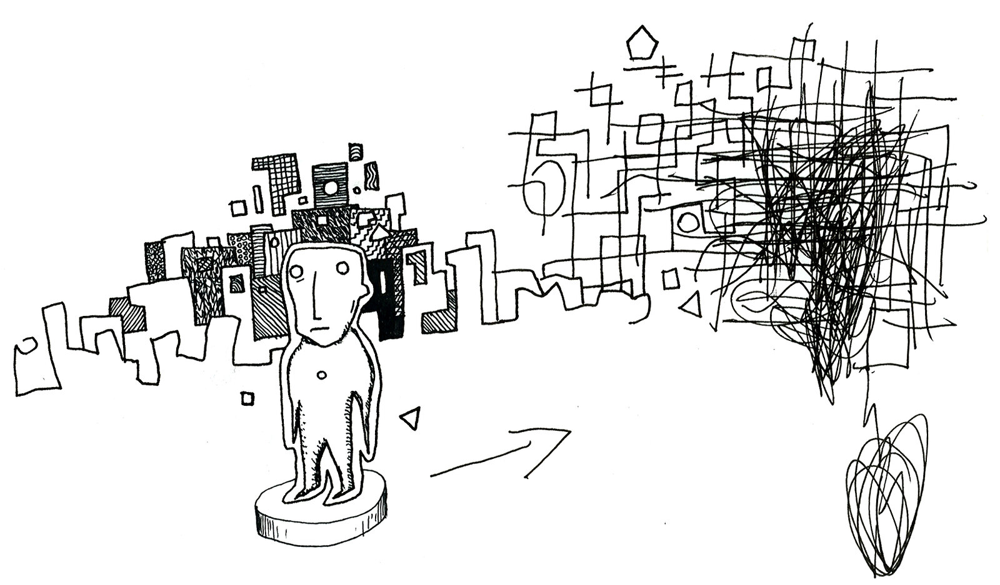
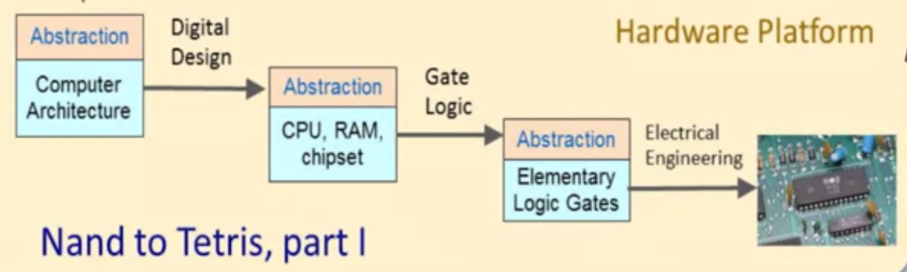
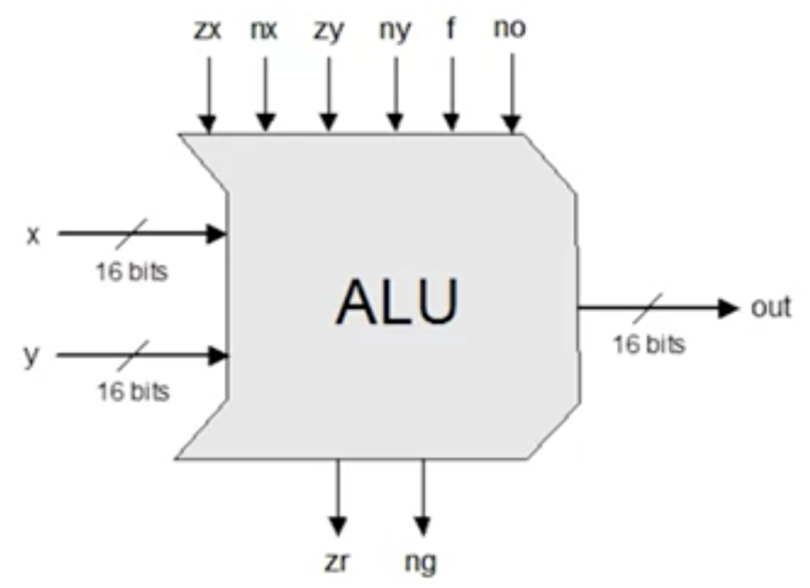
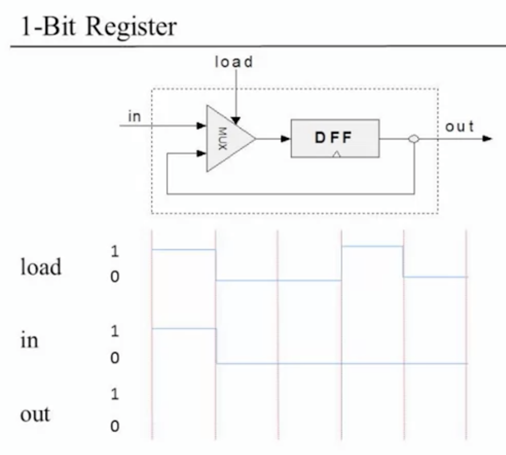
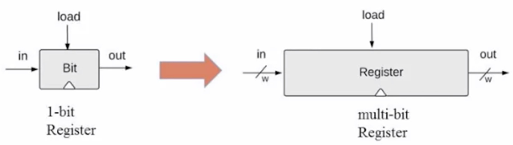
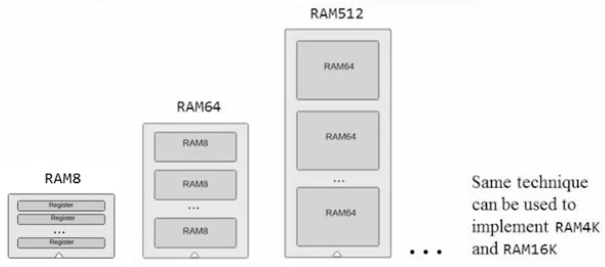
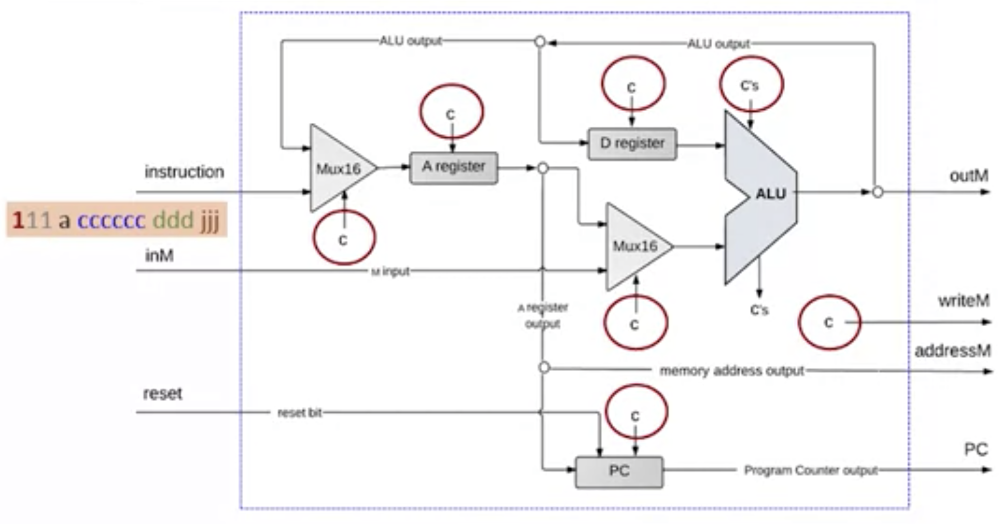
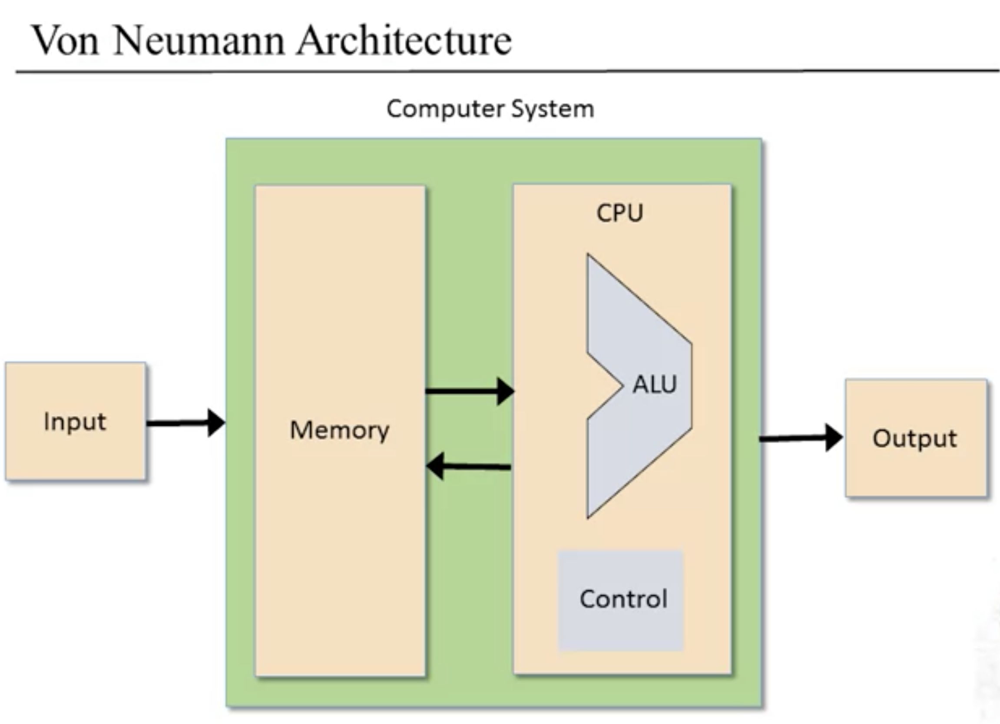

I completed the first half of the infamous [Nand2Tetris](https://www.nand2tetris.org/) course in September of 2020. This course, taught by Noam Nisan and Shimon Schocken, is a Massively Open Online Course (MOOC) delivered in two parts [on Coursera](https://www.coursera.org/learn/build-a-computer/home). I took all of the screenshots from the Coursera course.

As a largely self-taught developer, I've been actively strengthening my knowledge of [computer science fundamentals](https://teachyourselfcs.com/). For people seeking to do the same, this post provides a very high-level overview of what they would learn by taking this course. Admittedly, it's also a bit of show-and-tell to make me feel like less of an imposter among peers who have had a rigorous traditional education in computer science. Taking this course has made me a better software developer.

## What's covered

This whirlwind course tries to build a modern computer from first principles. Noam and Shimon teach this course through 12 projects that stack sequentially. The first half encompasses Boolean Logic Gates, Boolean Arithmetic Chips, Memory, Machine Language, Computer Architecture, and an Assembler.



The remainder of this post loosely follows the order that topics were presented in the course.

### Boolean Logic

All digital devices rely on boolean logic to process binary information. Nand gates can be used to construct all boolean operations. Here's a simple truth table for the Nand operation.

```txt
a  b  |  Nand(a,b)
--------------------
0  0  |    0
0  1  |    1
1  0  |    1
1  1  |    1
```

I created the logic for several fundamental hardware chips using Hardware Description Language (HDL) for the first project. Each of these chips was built using a combination of Nand gates as a starting point. What follows is some example HDL for an exclusive-or gate:

```VHDL
/**
 * Exclusive-or gate:
 * out = not (a == b)
 */
CHIP Xor {
    IN a, b;
    OUT out;

    PARTS:
    Nand(a=a, b=b, out=nandAB);
    Nand(a=a, b=nandAB, out=nandA);
    Nand(a=nandAB, b=b, out=nandB);
    Nand(a=nandA, b=nandB, out=out);
}
```

The complete list of gates I constructed includes, And, And16, DMux, DMux4Way, DMux8Way Mux, Mux4Way, Mux8Way, Mux16, Not, Not16, Or, Or8Way, Or16, and Xor.

### Boolean Arithmetic

Using the simple logic gates I wrote the [specification for a simple ALU](https://github.com/tylercrosse/nand2tetris/blob/main/projects/02/ALU.hdl), an incrementor, and a few adders. The ALU or Arithmetic Logic Unit, acts as the computational centerpiece of the CPU. This unit also gave a brief overview of binary math and two's complement. Here's an outline of the interface and functionality of the ALU I constructed using HDL:

```VHDL
Input:  x[16], y[16],   // Two 16-bit inputs
        zx,             // zero the x input?
        nx,             // negate the x input?
        zy,             // zero the y input?
        ny,             // negate the y input?
        f,              // compute out = x + y (if 1) or x & y (if 0)
        no;             // negate the out output?

Output: out[16],        // 16-bit output
        zr,             // 1 if (out == 0), 0 otherwise
        ng;             // 1 if (out < 0),  0 otherwise

Function:
        if (zx == 1) set x = 0        // 16-bit zero constant
        if (nx == 1) set x = !x       // bitwise not
        if (zy == 1) set y = 0        // 16-bit zero constant
        if (ny == 1) set y = !y       // bitwise not
        if (f == 1)  set out = x + y  // integer 2's complement addition
        if (f == 0)  set out = x & y  // bitwise and
        if (no == 1) set out = !out   // bitwise not
        if (out == 0) set zr = 1      // 16-bit equality comparison
        if (out < 0) set ng = 1       // two's complement comparison
```



### Memory

Next, Noam & Shimon introduced the notion of time and sequential logic. The course provides a data flip-flop (DFF), a fundamental chip and building block. Using the DFF as a starting point, I build a hierarchy of registers and RAM. The small registers are used to construct larger registers, which can then get stacked to create any size memory unit.

```
Data Flip-Flop -> 1-bit register -> 16-bit register -> RAMn
```







### Computer Architecture

The course presented computer architecture after the unit on machine language, an order that makes sense pedagogically. I've reversed the order of these two topics because it makes more sense hierarchically. You need a working CPU to run the machine language, which dovetails into the section on the assembler.

This unit dances through the stored program concept, von Neumann Architecture, the theory of memory, the role of the CPU, and finally, input and output. The project was one of the more difficult ones of the course and involved building a CPU from the chips made in previous units. You can [see my finished HDL code](https://github.com/tylercrosse/nand2tetris/blob/main/projects/05/CPU.hdl) for the CPU.



Here is the Hack instruction set, with symbolic mnemonics and the corresponding binary. The instruction set represents all of the operations the CPU can perform.

```nasm
// Adapted from Figure 4.5 in The Elements of Computing Systems.

A-instruction
        Symbolic: @xxx - (xxx is a decimal value ranging from 0 to 32767,
                          or a symbol bound o such a decimal value)
        Binary    0vvvvvvvvvvvvvvv

C-instruction
        Symbolic: dest = comp; jump   (comp is mandatory.
                                       If dest is empty, = is omitted;
                                       If jump is empty, the ; is omitted)
        Binary    111accccccdddjjj

    comp
 a==0  a==1  c c c c c c    dest  d d d  Effect: store comp in
 -----------------------   --------------------------------------
  0          1 0 1 0 1 0    null  0 0 0  the value is not stored
  1          1 1 1 1 1 1      M   0 0 1  RAM[A]
 -1          1 1 1 0 1 0      D   0 1 0  D register (reg)
  D          0 0 1 1 0 0     DM   0 1 1  D reg and RAM[A]
  A    M     1 1 0 0 0 0      A   1 0 0  A reg
 !D          0 0 1 1 0 1     AM   1 0 1  A reg and RAM[A]
 !A   !M     1 1 0 0 0 1     AD   1 1 0  A reg and D reg
 -D          0 0 1 1 1 1    ADM   1 1 1  A reg, D reg, & RAM[A]
 -A   -M     1 1 0 0 1 1
 D+1         0 1 1 1 1 1    jump  j j j  Effect
 A+1  M+1    1 1 0 1 1 1   ----------------------------------
 D-1         0 0 1 1 1 0    null  0 0 0  no jump
 A-1  M-1    1 1 0 0 1 0     JGT  0 0 1  if comp > 0 jump
 D+A  D+M    0 0 0 0 1 0     JEQ  0 1 0  if comp = 0 jump
 D-A  D-M    0 1 0 0 1 1     JGE  0 1 1  if comp >= 0 jump
 A-D  M-D    0 0 0 1 1 1     JLT  1 0 0  if comp < 0 jump
 D&A  D&M    0 0 0 0 0 0     JNE  1 0 1  if comp != 0 jump
 D|A  D|M    0 1 0 1 0 1     JMP  1 1 1  unconditional jump
```

#### Putting the pieces together

The Hack chipset that is created as part of this course follows a Von Neumann Architecture. It consists of input and output mechanisms, memory that stores data and instructions, a control unit containing an instruction register and program counter, and a processing unit containing an arithmetic logic unit (ALU) and processor registers.



### Machine Language

Machine language is the point where hardware meets software. A machine language is a hardware-dependent formalism for coding instructions. It provides a way of controlling hardware to perform logical arithmetic operations, read and write values from and to the computer's memory, and decide which instruction to fetch and execute next.

Here's an example of an elementary program written in the Hack machine language. At the end of this, the value 5 gets stored in RAM[0]:

```nasm
// Computes R0 = 2 + 3  (R0 refers to RAM[0])

@2      // A instruction - set the A register (reg) to the value 2
D=A     // D instruction - set the D reg to the value of the A reg (2)
@3      // A instruction - set the A reg to the value 3
D=D+A   // D instruction - set the D reg to D plus the value of the A reg (3)
@0      // A instruction - set the A reg to the value 0
M=D     // Store the value of the D reg to the current memory address (0)
```

### Assembler

The first half of this course culminated in writing an assembler that can take hack machine language and translate it from its symbolic form into its binary format, which can be loaded onto the Hack computer. Here's the output of the above example hack machine language from the assembler:

```nasm
0000000000010000 // @2
1110110000010000 // D=m
0000000000010001 // @3
1110000010010000 // D=D+A
0000000000010010 // @0
1110001100001000 // M=D
```

I added comments to make it easier to map this output back to the instruction set.

I wrote a [simple parser and symbol table in Typescript](https://github.com/tylercrosse/nand2tetris/blob/main/projects/06/AssemblerTS) and had a lot of fun along the way. I'm looking forward to the last half of this course.
