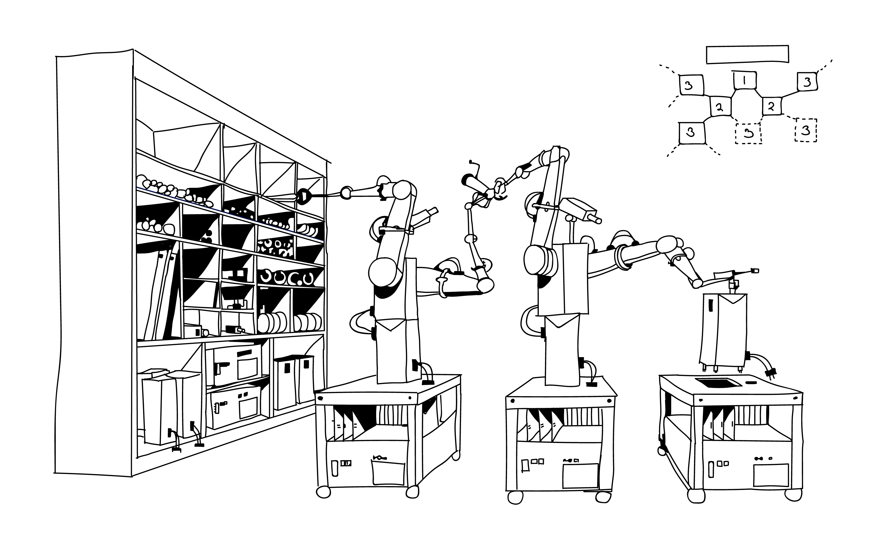
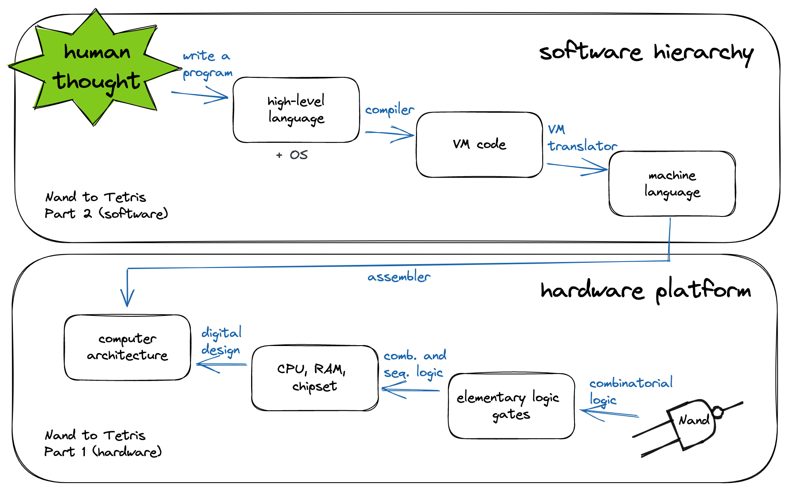
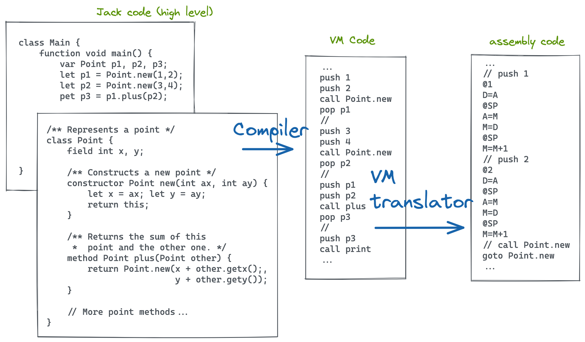
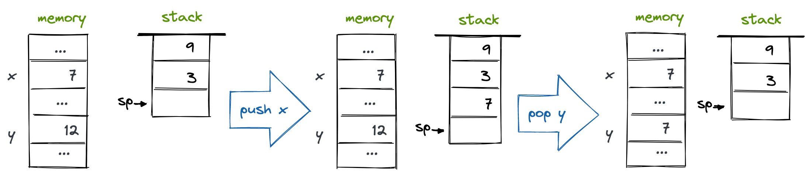
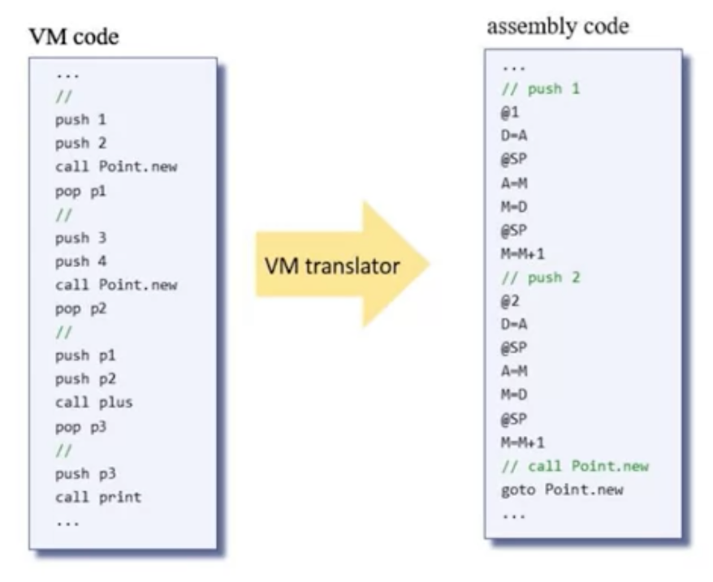

## What the heck is a VM Translator?

A VM Translator is a program that takes VM code as input and spits out assembly code as output. That's all well and good if you know what VM code even is.

To contextualize VM Translation, I think it's helpful to take a step back and see where this fits in the overall process of going from human thought to instructions that can be executed on hardware. Developers start with an idea about what they want to create. They turn these thoughts into programs that are typically written in high-level languages like Java, Python, or Javascript. High-level languages obscure many nitty-gritty details about how the hardware should execute programs. This allows developers to focus more on the 'what' and less on the 'how.' From there, high-level languages are compiled into a form specific to the hardware they need to get run on.

The hardware side is where the first portion of the Nand to Tetris course picks up. I [previously summarized](/ideas/nand2tetris-part1) of the topics discussed in the first six modules of the course.



VM Translation sits in the middle to the tail end of the software hierarchy. The Jack programming language, modeled after Java, uses a two-tier compilation. High-level languages are compiled to VM code as an intermediate step before being translated into a hardware-specific assembly language. The VM Translator performs the step of taking the VM code that a compiler spits out and returning assembly code. By splitting compilation into two steps, each can be made simpler.

Another benefit of two-tiered compilation is that it allows multiple programming languages to compile to the intermediate VM code and then share the same VM translation software. For example, Java, Groovy, Kotlin, Scala, and Clojure compile from their respective files into \*.class files, which can then be run on the Java virtual machine (JVM) instead of all needing separate code to compile to assembly on different host platforms.

For the nand2tetris course, the VM Translator I built creates code for the Hack computer I made in the [first half of this course](/ideas/nand2tetris-part1).



## Stack Machine

The underpinning of the virtual machine is something called a Stack Machine. Yes, it's a tad confusing to be introduced to more than one abstract thing called a machine. The critical insight here is that using the concept of a stack machine enables us to turn complex programs into a lower-level abstraction that is still sufficiently high-level to save mental energy when thinking about them. That's the beauty of having different levels of abstraction; it helps shape the world in models that are simple enough to fit into our dumb monkey brains. Stack machines are Turing complete, which as Nisan and Schocken say,

> "Any program, written in any high-level programming language, can be translated into a sequence of operations on a stack."

A stack is a sequence of memory that can grow and shrink as needed. The two key operations on the stack are `push` and `pop`.



The hack VM model is stack-based in which all of the operations take their operand either from the stack or store their results on the stack. In the example above f

## Virtual Memory Segments

## Semantics

#### Push / Pop Commands

Push / Pop commands transfer data between the stack and memory segments.

`push` _segment index_: Pushes the value of _segment[index]_ onto the stack, where _segment_ is argument, local, static, this, that, pointer, or temp and _index_ is a nonnegative integer.

`pop` _segment index_: Pops the top stack value and stores it in _segment[index]_, where _segment_ is argument, local, static, this, that, pointer, or temp and _index_ is a nonnegative integer.

#### Arrithmetic-logical commands

These commands perform arithmetic and logical operations.

```
// arithmetic-logical commands of the VM language

cmd     op     comment
-------------------------------------------------------
add   x + y    integer addition (two's complement)
sub   x - y    integer subtraction (two's complement)
neg   -y       arithmetic negation (two's complement)
eq    x == y   equality
gt    x > y    greater than
lt    x < y    less than
and   x And y  bit-wise And
or    x Or y   bit-wise Or
not   Not y    bit-wise Not
```

#### Branching Commands

Branching commands facilitate conditional and unconditional branching.

`label` _label_: Labels the current location in the function's code. Only labeled locations can be jumped to. The scope of the label is the function in which it is defined. The label is a string composed of any sequence of letters, digits, underscore, dot, and color that does not begin with a digit. The `label` command can be located anywhere in the function, before or after the goto commands that refer to it.

`goto` _label_: Effects an conditional goto operation, causing execution to continue from the location marked by the label. The goto command and the labeled jump destination must be located in the same function.

`if-goto` _label_: Effects a conditional goto operation. The stack's topmost value is popped; if the value is not zero, execution continues from the location makred by the label; otherwise, execution continues from the next command in the program. The if-goto command and the labeled jump destination must be located in the same function.

#### Function Commands

Function commands facilitate function call-and-return operations.

`function` _functionName nVars_: Marks the beginning of a function named _functionName_. The command informs that the function has _nVars_ local variables.

`call` _functionName nArgs_: Calls the named function. The command informs that _nArgs_ arguments have been pushed onto the stack before the call.

`return`: Transfers execution to the command just following the call command in the code of the function that called the current function.



Many of the images used in this post are recreations from the exellent book [The Elements of Computing Systems](https://www.amazon.com/Elements-Computing-Systems-Building-Principles/dp/0262640686) by Noam Nisan and Shimon Schocken or from their [content on Coursera](https://www.coursera.org/learn/nand2tetris2/home).
