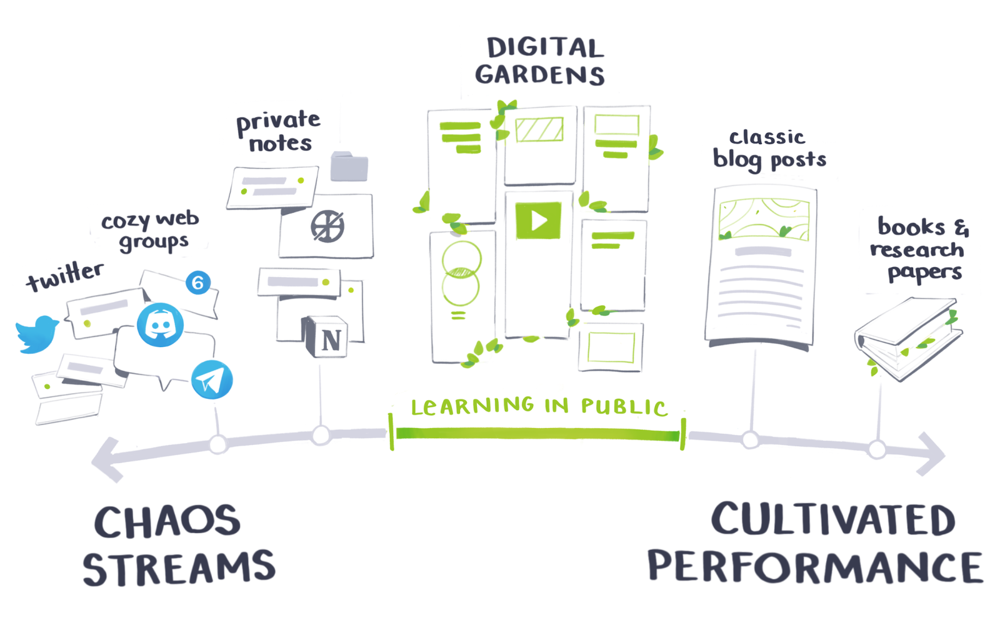

## Planting seeds

I recently read Maggie Appleton's [essay about digital gardens](https://maggieappleton.com/garden-history) and was deeply inspired. Her words shone like a beacon as a way to publicly share ideas without the gravity of traditional publishing. She spends much of her essay contextualizing how the term came to be and doesn't ascribe ownership.

Maggie defines digital gardens by describing six attributes commonly attached to them.

1. Gardens are organized around contextual relationships and associative links instead of when pieces are first published chronologically.
2. Gardens are never finished. Authors can refine posts at any time. Maggie makes an important caveat that it is vital to display when posts are updated.
3. Gardens are imperfect by design. They exist as a way to learn in public. The status of the level of imperfection should also be made clear to readers.
   This wonderful illustration by Maggie perfectly contextualizes this:

4. Gardens should be unique personal play spaces full of quirks, contradictions, and complexity.
5. Gardens exhibit a density of content that embraces the abundance of content and media that the web can offer.
6. Gardening is about calming a small patch of the web for yourself, one you fully own and control.

She generously offers that "no one owns /The Official Definition/ of digital gardening. Numerous people have contributed to the growing conversation, and you should read their thoughts as well."

## Nourishing Soil

I want to dip my toes deeper into writing. As a novice penman, the bar for crafting content that feels publishable has often felt too high. I hope to reform my website into a place where I can publish and curate things I find interesting. All of the things I write don't need to be as fleshed out—the spirit of learning in public peels back some of the mask of perfection commonly presented in digital personas.

The flip side is that highly edited, deeply researched articles are more valuable to readers than a half-baked blurb written in a stream-of-consciousness style. What I find so encouraging about digital gardens is that it allows both types of content to exist side by side in an obvious manner to readers. This juxtaposition helps visitors find rich, polished content and be encouraged by another person's flaws.
