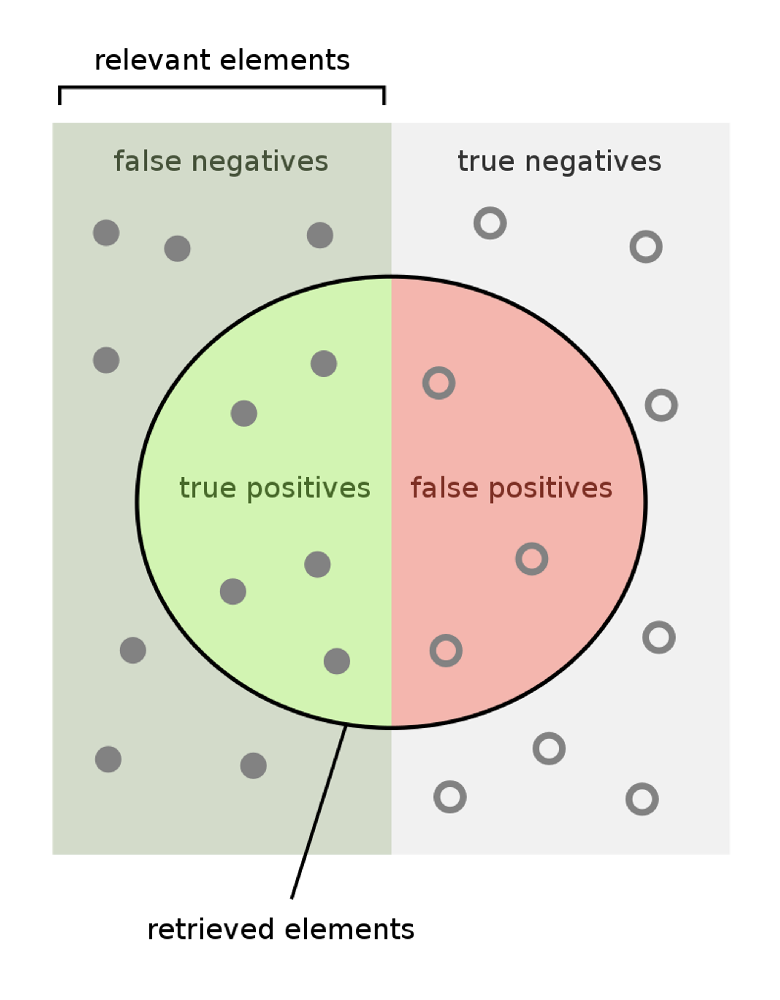
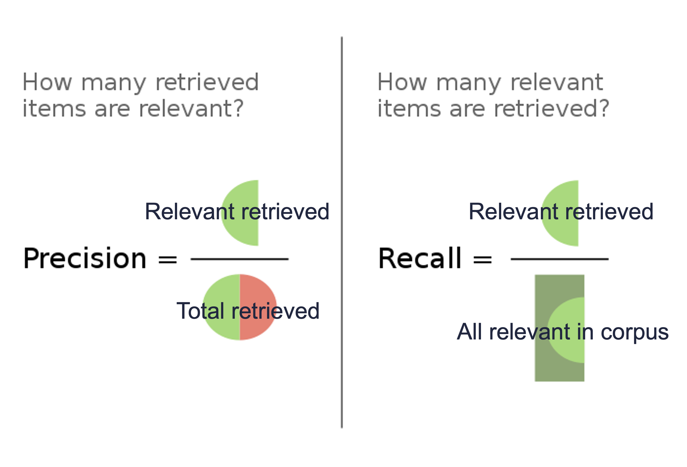
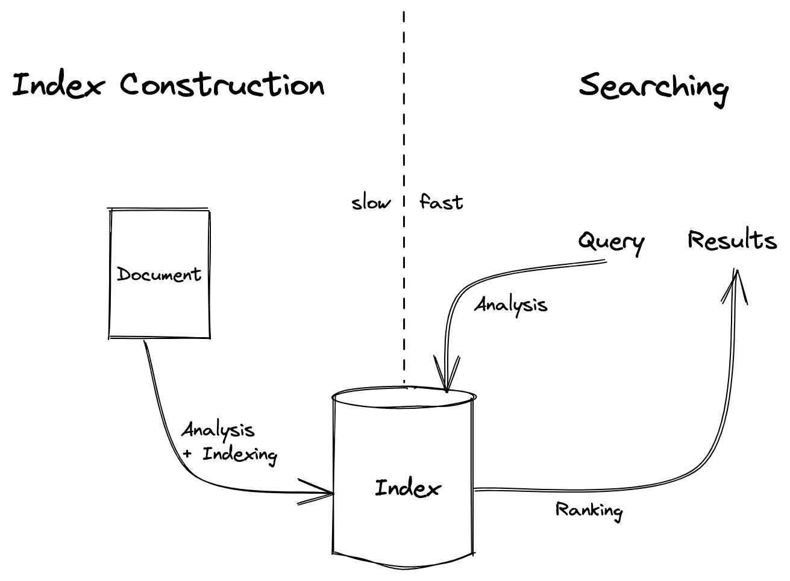

The use of search has become ubiquitous. It's been more than twenty years since the American Dialect Society chose the verb "Google" as the most useful word of 2002. Yet I've found in practice that the fundamental vocabulary of search lacks a shared understanding of how it is expected to function.

Users want to enter a vague bit of text into a search box and get back a list of relevant results. But what does "relevant" mean? How does the search engine decide what is relevant? How does the user decide what is relevant? How does a user even know what they are looking for or decide what text to put in the search box in the first place?

There is a rift between the universal usage of search engines and the academic topics of how they work.

This article aims at establishing a basic understanding of search engines by attempting to make the underlying concepts more approachable. It is not meant to be a comprehensive guide. Rather, it is a starting point for a conversation about search.

## Defining terms

There are three basic components of a search engine, the query, the document, and the index.

**Query** - The text entered into the search box. This is the front door to how users interact with search engines. Queries represent an intent for information and the way a user decides to form the query is a topic of its own.

**Document** - The thing returned from the search engine. Each result is a document. This is also the basic piece of information that gets fed into the search engine. Documents can be anything from a web page to a product to a word file. Documents are the building blocks of the index.

**Index** - The place where the magic happens. Indexes can be thought of abstractly like the index in the back of a book - it's the thing that holds references to all the documents and is the thing that gets searched. Indexes are the reason that search engines can return results so quickly.

Putting these three together helps to pin down what a search engine is.

**Search Engine** - A tool for informatin retrieval that takes a query and returns a list of documents from an index. This broad definition encompasses systems that operate at very different scales and includes systems like Google that have billions of documents, to ones that span a single website or organization's data with often tens of thousands to millions of documents, to the local search on your single computer or phone.

## Relevance

With the basics defined we can start to look at more of the nuances of search engines.

How effective a search engine is can be measured by how relevant the results it returns are. [Relevance](<https://en.wikipedia.org/wiki/Relevance_(information_retrieval)>) is the most important way of evaluating how effective a search engine is. Unfortuantely it's also quite difficult to automatically measure.

> Relevance is a measure of how well the documents retrieved by a search engine meet the information need of the user.

The more a document matches what you were looking for the more relevant it is. A perfect search would return only relevant documents and all of the ones that possibly exist. Unfortunately we don't live in a perfect world.

To help quantify this search practitioners call any document that is relevant and returned by a search a true positive. If it is returned and not relevant it is a false positive. Relevant documents not returned are called false negatives - they were missed. Non-relevant docs not returned are true negatives.

  

Precision helps explain how many of the results returned are relevant. Recall describes how many of all the possible relevant documents that exist were returned.

  

Search engines can be tuned to improve the relevance of results and try to improve these metrics. Sadly, precision and recall are sometimes at odds with each other. Improving the precision can cause fewer total docs to be returned and thus can lower the recall. Conversely, methods to result in more of the total relevant being returned often reduce the overall precision of the search.

## An example - Looking for a Daschund

As an example, imagine we're searching for a daschund. Yeah those two little guys right in the middle.

Now let's say for whatever reason you searched for "brown" and this is what you got back:

As luck would have it we found one of the two daschunds but missed the other - maybe the striped seater got in the way. Of the nine results returned, our gal is a true positive and the other eight are false positives. The missed daschund is a false negative and the remaining nine animnals are true negatives. From that we can determine the precision and recall of our query.

Fortunately the greatest tool search engines have to get around the see-saw between precision and recall is their ranking. By putting the most relevant documents first it matters a lot less if a chunk of the results aren't relevant.

## How Search Engines Work

The user journey we're all familiar with is:

1. User enters a query into a search box
2. Search engine returns a list of documents
3. User interacts with the results.

But what happens in between? How does the search engine know what documents to return? How does it know what documents to index in the first place?

### Building the Index

Search engines do a lot of work before users start searching. Getting results quickly when a query is entered takes a lot of heavy lifting upfront. The first step is to build the index.

Work is done on each document as it is added to figure out what it's about and how to store it in a way that will allow it to be quickly found again later. This is called indexing. It often involves analysis - cleaning up data, normalizing it, enriching it with metadata, and breaking it down into smaller pieces. There are many different strategies for how to do this and I'll touch on a few of the common approaches later.

How documents get into the index and the type of metadata that gets stored in the index varies from one search engine to the next. Some search engines, like Google, crawl the web and index every page they find. They have programs that are constantly covering as much of the web as they can get their digital hands on and sucking up everything they can find. Other search engines require that documents are manually added or added as new documents are created.

### Querying the Index

Assuming the heavy lifting was done up-front, the query is the easy part. The search engine takes the query and looks up the documents that match. The search engine then ranks the documents based on how well they match the query and returns the top results. Exactly how they use queies to find documents and orders the results depends on how the index was created and a ranking function.

Search engines are dumb machines and all of the functionality they are capable of has to be carefully crafted. They have to determine which documents match a query. To do this they often performa similar analysis on queries as was performed the documents when they were added to the index. If all the docs were turned into round holes the query needs to be turned into a round peg to match.

Once all the matches are found they are ranked using a forumla that tries to intuit which documents are the closest of most valuable matches to the user's query. This ranking process can vary a lot between search engines.

  

To summarize, constructing the index is slow, which allows searching to be fast. Documents are analyzed as they are added to the index. Queries are analyzed in a similar manner to help match them against documents in the index. Matches in the index are ranked by the search engine and returned as results.

### Additional Resources

- A great much deeper dive is the book [Relevant Search by Doug Turnbull and John Berryman](https://www.manning.com/books/relevant-search). It's written with a focus for developers but most of the first few chapters is very readable by a general audience.
