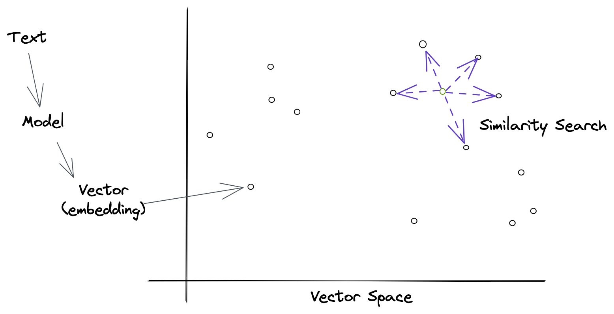

Emma is looking for information about a new movie she wants to see. She searches for "new movie" on a site with data about movies, but the results are not very relevant. She tries again with "new movie 2021", but still doesn't find what she's looking for. Finally, she searches for "new movie 2021 trailer" and finds exactly what she was looking for.

Why did Emma have to search three times? Because the search engine she was using is not very good at understanding what she wants. It's not smart enough to know that she's looking for a movie trailer, so it shows her a bunch of irrelevant results instead.

What if there was a better way? What if there was a search engine that could understand what Emma wants and show her exactly what she's looking for? That's what similarity search does. It uses neural networks to understand what people are looking for and show them relevant results.

## What is semantic search?

Similarity search is a technique for finding similar items in a large dataset. It's used in a variety of applications, including recommendation systems, information retrieval, computer vision, and natural language processing. In information retrieval (aka. search engines), **similarity search is used to find documents that are similar to a given query based on the meaning of the words in the query and the documents instead of purely matching the words themselves.**

Semantic search is an approach that goes by many names - some of the common ones are vector search, approximate nearest neighbors, similarity search, and neural search. The core idea is the same: use a model to generate vectors for each item in a dataset and then use those vectors to find similar items. 

## What is it good at?

More traditional keyword search is excellent at finding results that contain the exact words in the query. However, it's not very good at understanding the meaning of the words in the query and the documents. This means that it can't find results that are similar to the query but don't contain the exact words. For example, if you search for "new movie 2021 trailer", you'll get results that contain those exact words. But if you search for "new movie 2021", you won't get any results because there are no documents that contain those exact words.

The approach that powers semantic search enables improved results for question answering, recommendations, classification, and can be fine-tuned with domain-specific knowledge. It can also be used to find similar images, videos, and audio. In general, it can find patterns in unstructured data. For this article, we'll constrain ourselves to just text-based similarity search and focus on information retrieval.

## How does semantic search work?

Similarity search is a broad topic, and there are many different techniques. The most common approach is to use a vector space, where each item is represented as a vector of numbers called an embedding. The embedding vectors are then compared using a distance metric, such as cosine similarity or approximate nearest neighbor. For text, large language models like BERT and ChatGPT are great at generating embeddings that capture the semantic meaning of the text.

All of that is a mouthful and for most people, it's not very helpful. So let's break it down into simpler terms. 

#### What are vectors and embeddings?

Vectors are just lists of numbers. A decent way to think about vectors is as a row in a spreadsheet where each cell is a number. They can be used to represent anything - natural phenomena like velocity and acceleration in addition to things we care about searching for like words, images, and documents. Vectors let us turn important things into numbers that computers can understand and work with.

Models typically do this conversion from text to numbers in a few steps. First, they create a vocabulary of all the words or parts of words they care about. Then they assign each a unique number. Then they create a vector for each word by setting the number at the index of the word to 1 and all other numbers to 0. This creates a vector called one-hot encoding. These one-hot vectors are a good start but don't tell much about the meaning of words and are mostly zeros, often referred to as sparse.

The one-hot vectors are fed into a model that was trained on a large body of text and has learned the statistical relationships between words. This process of feeding data to a trained model is typically called inference. The model is a humongous math formula, like a spreadsheet on steroids, with a ton of numbers in them called weights and biases. The model takes in the one-hot vectors, does a bunch of multiplications, and outputs an embedding vector. The embedding vectors are dense, meaning they have a lot of non-zero values, and have been embued with meaning from the model.

Interestingly enough, the model doesn't actually know what the words mean - the model is just numbers and equations. It just knows that certain words are more likely to appear together than others. This is called distributional semantics and is a powerful way to represent the meaning of words. It's also the reason why models like BERT and ChatGPT are so good at generating embeddings that capture the semantic meaning of text. It's also a big challenge for understanding why models make certain predictions.

Words that have similar meanings to humans get used in sentences in similar ways. For example, the words "queen" and "queen" are both nouns and are often used in the same context. The model learns this relationship and encodes it in the embedding vectors. As a result, the embedding vectors for "queen" and "queen" are similar to each other. The model has learned that they are similar to each other and has encoded that information in the embedding vectors.

#### How do you compare vectors?

Once we have a few embedding vectors, we need a way to compare them. The most common way to do this is with a distance metric, such as cosine similarity or approximate nearest neighbor. These metrics measure how similar two vectors are to each other. The higher the score, the more similar they are. The lower the score, the less similar they are.

In practice, it's computationally expensive to compare every vector against every other vector. A ton of approaches have surfaced to make approximate nearest neighbor search more efficient and all come with a set of trade-offs. The key thing is that it's now possible to search through millions of vectors in milliseconds. Making semantic search practical at scale.

## Additional Resources

- For more on word embeddings, check out [this article](https://towardsdatascience.com/deep-learning-for-nlp-word-embeddings-4f5c90bcdab5) by James Thorn
- A helpful [overview of semantic search](https://medium.com/ml6team/semantic-search-a-practical-overview-bf2515e7be76) by Mathias Leys
