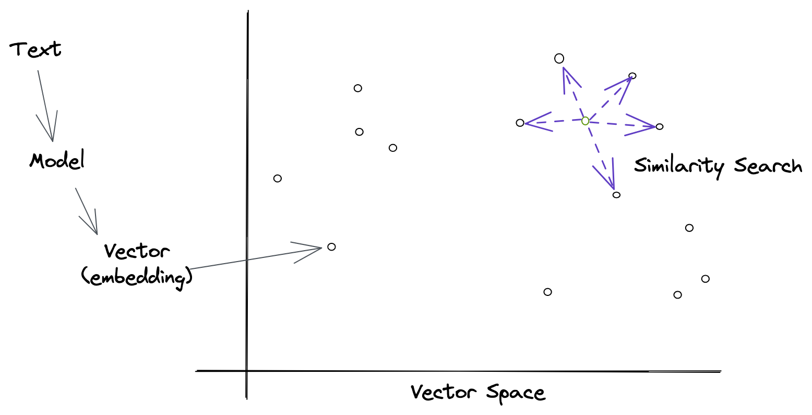

Emma is looking for information about a new movie she wants to see. She searches for "new movie" on a site with data about movies, but the results are not very relevant. She tries again with "new movie 2021", but still doesn't find what she's looking for. Finally, she searches for "new movie 2021 trailer" and finds exactly what she was looking for.

Why did Emma have to search three times? Because the search engine she was using is not very good at understanding what she wants. It's not smart enough to know that she's looking for a movie trailer, so it shows her a bunch of irrelevant results instead.

What if there was a better way? What if there was a search engine that could understand what Emma wants and show her exactly what she's looking for? That's what similarity search does. It uses neural networks to understand what people are looking for and show them relevant results.

## What is semantic search?

Similarity search is a technique for finding similar items in a large dataset. It's used in a variety of applications, including recommendation systems, information retrieval, computer vision, and natural language processing. In information retrieval (aka. search engines), **similarity search is used to find documents that are similar to a given query based on the meaning of the words in the query and the documents instead of purely matching the words themselves.**

Semantic search is an approach that goes by many names - some of the common ones are vector search, approximate nearest neighbors, similarity search, and neural search. The core idea is the same: use a model to generate vectors for each item in a dataset and then use those vectors to find similar items. For this article, we'll constrain ourselves to just text-based similarity search and focus on information retrieval.

- some examples of when similarity search is effective

## How does semantic search work?

Similarity search is a broad topic, and there are many different techniques. The most common approach is to use a vector space, where each item is represented as a vector of numbers called an embedding. The embedding vectors are then compared using a distance metric, such as cosine similarity or approximate nearest neighbor. For text, large language models like BERT and ChatGPT are great at generating embeddings that capture the semantic meaning of the text.

All of that is a mouthful and for most people, it's not very helpful. So let's break it down into simpler terms. 

#### What are vectors and embeddings?

Vectors are just lists of numbers. A decent way to think about vectors is as a row in a spreadsheet where each cell is a number. They can be used to represent anything - natural phenomena like velocity and acceleration in addition to things we care about searching for like words, images, and documents. Vectors let us turn important things into numbers that computers can understand and work with.

Models typically do this conversion from text to numbers in a few steps. First, they create a vocabulary of all the words or parts of words they care about. Then they assign each a unique number. Then they create a vector for each word by setting the number at the index of the word to 1 and all other numbers to 0. This creates a vector called one-hot encoding. These one-hot vectors are a good start but don't tell much about the meaning of words and are mostly zeros, often referred to as sparse.

The one-hot vectors are fed into a model that was trained on a large body of text and has learned the statistical relationships between words. This process of feeding data to the model is typically called inference. The model is a humongous math formula, like a spreadsheet on steroids, with a ton of numbers in them called weights and biases. The model takes in the one-hot vectors, does a bunch of multiplications, and outputs an embedding vector. The embedding vectors are dense, meaning they have a lot of non-zero values, and have been embued with meaning from the model.

Interestingly enough, the model doesn't actually know what the words mean - the model is just numbers and equations. It just knows that certain words are more likely to appear together than others. This is called distributional semantics and is a powerful way to represent the meaning of words. It's also the reason why models like BERT and ChatGPT are so good at generating embeddings that capture the semantic meaning of text. It's also a big challenge for understanding why models make certain predictions.

Words that have similar meanings to humans get used in sentences in similar ways. For example, the words "queen" and "queen" are both nouns and are often used in the same context. The model learns this relationship and encodes it in the embedding vectors. As a result, the embedding vectors for "queen" and "queen" are similar to each other. The model has learned that they are similar to each other and has encoded that information in the embedding vectors.

#### How do you compare vectors?

Once we have a few embedding vectors, we need a way to compare them. The most common way to do this is with a distance metric, such as cosine similarity or approximate nearest neighbor. These metrics measure how similar two vectors are to each other. The higher the score, the more similar they are. The lower the score, the less similar they are.

## Similarity search in practice

Now that we have a basic understanding of how similarity search works, let's look at how it's used in practice. The most common use case is to find similar documents based on a query. This is done by creating a vector for the query and then comparing it to the vectors for each document in the dataset. The documents with the highest similarity score are returned as the results.

- question answering
- document retrieval & re-ranking results
- extracting matching phrases
- domain-specific knowledge
- pooling

## Additional Resources

- For more on word embeddings, check out [this article](https://towardsdatascience.com/deep-learning-for-nlp-word-embeddings-4f5c90bcdab5) by James Thorn
- A helpful [overview of semantic search](https://medium.com/ml6team/semantic-search-a-practical-overview-bf2515e7be76) by Mathias Leys

---

## WIP

How do we turn words into vectors (remember vectors are just numbers)? First, we start by creating a vocabulary of all the words we care about. Then we assign each word a unique number. Then we create a vector for each word by setting the number at the index of the word to 1 and all other numbers to 0. This creates a vector called one-hot encoding.

The one hot-encoding is a good start, but it's not very useful. It doesn't capture any information about the meaning of the words. The one hot-encoding is also very sparse, which means that most of the numbers in the vector are 0. This makes it hard to compare vectors to one another. What we really want is a way to represent words as vectors that capture their meaning and are dense (i.e., most of the numbers are not 0).

#### What are embeddings?

To solve this problem, we can use embedding vectors. The ways to create embeddings have evolved and the latest and most effective approach is to use a large language model - a neural network on a large corpus of text. The neural network learns to predict the context of each word, and the resulting vectors are used to represent the words. This allows us to compare words based on their meaning, rather than just their spelling.

