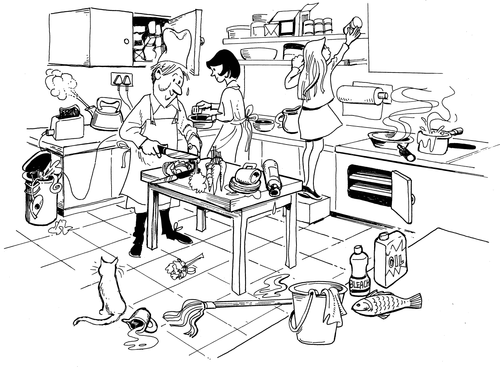
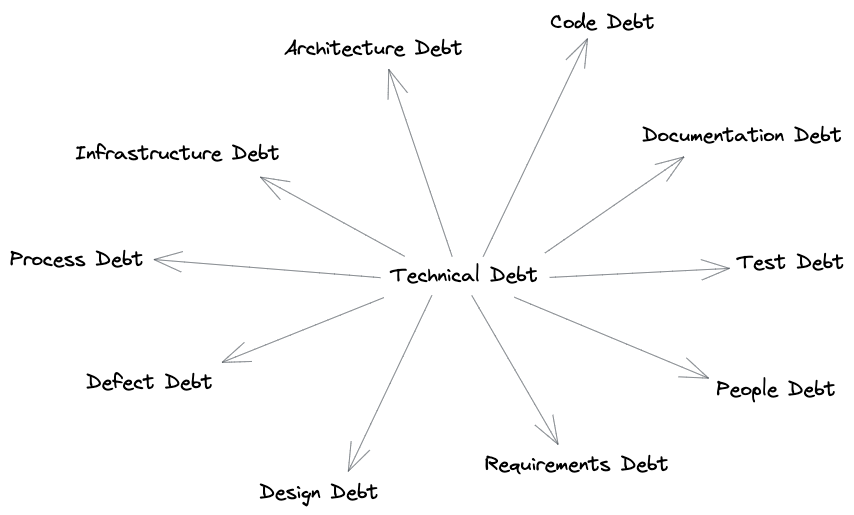

"If you run a commercial kitchen and you only ever cook food, because selling cooked food is your business -- if you never clean the dishes, never scrape the grill, never organize the freezer -- the health inspector will shut your shit down pretty quickly.

Software, on the other hand, doesn't have health inspectors. It has kitchen staff who become more alarmed over time at the state of the kitchen they're working in every day, and if nothing is done about it, there will come a point where the kitchen starts failing to produce edible meals.

Generally, you can either convince decision-makers that cleaning the kitchen is more profitable in the long run or you can dust off your resume and get out before it burns down."

I came across this gem of an explanation in a [hacker news comment](https://news.ycombinator.com/item?id=25008587) on technical debt, in response to a [great post](https://daverupert.com/2020/11/technical-debt-as-a-lack-of-understanding/) by Dave Rupert.

## Ok but that's not useful

What software does is obvious, there are buttons to press that do magic when you press them. Yet _how_ they work is, well, magic. This is why we end up leaning on kitchen or banking metaphors to help explain the act of creating software. The challenges associated with building software are hopefully invisible to the end user, and even hard to pin down with developers and their coworkers.

Software is complex and that complexity is hard to see and hard to manage. As more features are added, the complexity grows. If the growing complexity isn't kept in check it can make it harder to add new features, or even to fix bugs. This is technical debt.

Ward Cunningham who coined the term "technical debt" explains that "if you develop a program for a long period of time by **only adding features but never reorganizing it to reflect your understanding of those features**, then eventually that program simply does not contain any understanding and all efforts to work on it take longer and longer."

Rupert harps on this and suggests that a big part of the reason that building software can take more time is due to a lack of understanding. I think this extends past software and into the realm of knowledge work in general. Or at the very least building knowledge-based products like software without ever going back to clean up and re-organize ultimately slows down the ability to grow.

Researchers at Carnegie Mellon University have been studying technical debt for years and have found that it is a major factor in the success or failure of software projects. In a 2014 presentation on the ontology of tech debt that was based on a survey of the literature, broke tech debt down into a few related categories that I recreated below.

Slow down and fix stuff, or keep moving fast and break stuff. The choice is yours.

## Additional Resources

- Ward Cunningham [reflects](https://www.youtube.com/watch?v=pqeJFYwnkjE) on the history, motivation and common misunderstanding of the "debt metaphor" as motivation for refactoring.
- Dave Rupert [explains](https://daverupert.com/2020/11/technical-debt-as-a-lack-of-understanding/) technical debt as a lack of understanding.
- Presentation on the [ontology of tech debt](https://resources.sei.cmu.edu/library/asset-view.cfm?assetID=516144) by Nicolli S.R. Alves, Leilane F. Riberio, et. al.
- A [study](https://insights.sei.cmu.edu/blog/a-field-study-of-technical-debt/) on the sources of tech debt by Neil Ernst