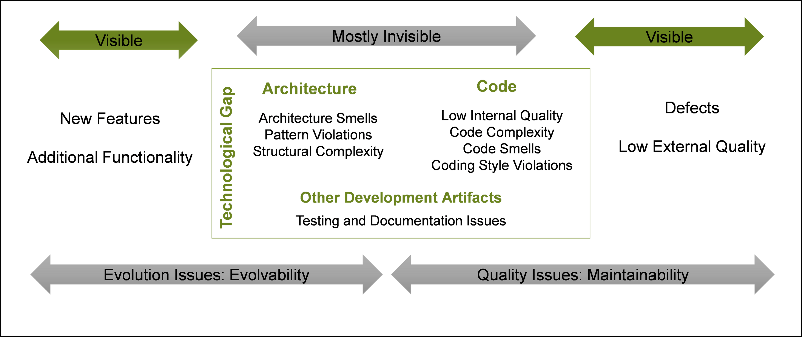

[Technical debt as a lack of understanding](https://daverupert.com/2020/11/technical-debt-as-a-lack-of-understanding/) and the associated [hacker news post/discussion](https://news.ycombinator.com/item?id=25008587).

From Ward Cunningham, the software programmer who originally coined the phrase “technical debt”:

“If you develop a program for a long period of time by **only adding features** but **never reorganizing it to reflect your understanding** of those features, then eventually that program simply does not contain any understanding and all efforts to work on it take longer and longer.” 

An alternate analogy for non-technical stakeholders In the comments: 

"If you run a commercial kitchen and you only ever cook food, because selling cooked food is your business -- if you never clean the dishes, never scrape the grill, never organize the freezer -- the health inspector will shut your shit down pretty quickly.

Software, on the other hand, doesn't have health inspectors. It has kitchen staff who become more alarmed over time at the state of the kitchen they're working in every day, and if nothing is done about it, there will come a point where the kitchen starts failing to produce edible meals.

Generally, you can either convince decision-makers that cleaning the kitchen is more profitable in the long run or you can dust off your resume and get out before it burns down."

## Why it matters

From: https://insights.sei.cmu.edu/sei_blog/2016/08/the-future-of-managing-technical-debt.html

## Categorizing Debt

From https://resources.sei.cmu.edu/asset_files/Presentation/2014_017_101_312139.pdf

## Sources of Debt

From https://insights.sei.cmu.edu/sei_blog/2015/07/a-field-study-of-technical-debt.html

